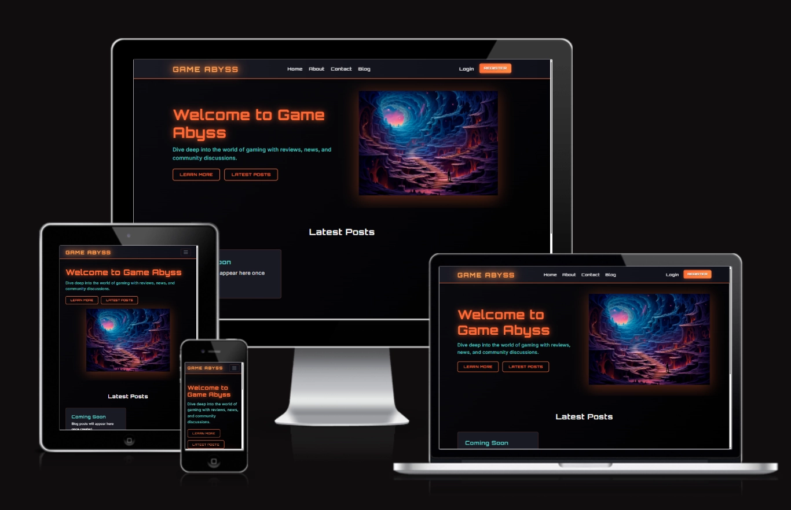

<h1 align="center">
  
  Milestone Project 3: Game Abyss
</h1>

<p align="center">
  <em><strong>
    A community-driven gaming blog built with Django and PostgreSQL.<br>
    Share reviews, discover new games, and join the conversation!
  </strong></em>
</p>

---

## 👉 [Visit Game Abyss](https://game-abyss-a25a8ac090c2.herokuapp.com/)



---

## Table of Contents

1. [Project Overview](#project-overview)
2. [User Experience Design](#user-experience-design)
    - [User Stories](#user-stories)
    - [Structure](#structure)
    - [Design](#design)
        - [Wireframes](#wireframes)
        - [Colour Palette](#colour-palette)
        - [Typography](#typography)
3. [Features](#features)
    - [Existing Features](#existing-features)
    - [Future Features](#future-features)
4. [Database Design](#database-design)
5. [Technologies Used](#technologies-used)
6. [Testing & Bug Fixes](#testing--bug-fixes)
7. [Deployment](#deployment)
    - [Local Development](#local-development)
    - [Heroku Deployment](#heroku-deployment)
8. [Credits](#credits)

---

## Project Overview

Welcome to **Game Abyss!**

A modern blog platform designed for the gaming community. Whether you're a casual player or a hardcore gamer, Game Abyss is your space to:

> Share your thoughts, read reviews, and connect with fellow gamers from around the world!

### The Story Behind Game Abyss

Here's the truth: **I've wanted to create a gaming blog for ages!**

For years, I've been thinking: _"Wouldn't it be cool to have my own gaming community where people can share reviews, discuss their favorite games, and just... talk about gaming?"_ But I never knew where to start or how to build it.

Then came my journey with **Python and Django** through the Code Institute course, and suddenly everything clicked! 🎯

I realized: _"Wait a minute... I'm literally learning exactly what I need to build that blog I've always wanted!"_

So instead of creating just another practice project to tick off the assessment requirements, I thought: **"Why not make this count? Why not build something I actually care about and can continue developing after graduation?"**

And that's how Game Abyss was born! 🚀

This project is my way of combining:

- ✅ My passion for gaming (I've been a gamer since I was a kid!)
- ✅ My newly acquired Python and Django skills
- ✅ My long-term dream of running a gaming community
- ✅ A real-world portfolio project I'm genuinely proud of

The best part? This isn't just a one-and-done academic project. I'm already planning features to add after I submit this (comments system, user profiles, game reviews database, maybe even an API!). Game Abyss is just getting started! 💪

### Key Features

- **User Authentication**: Secure registration, login, and password reset functionality powered by Django-allauth
- **Professional Email System**: Real password reset emails via SendGrid (not just console output!)
- **Responsive Design**: Fully responsive interface that works beautifully on all devices
- **Admin Dashboard**: Comprehensive Django admin panel for content management
- **Modern Dark Theme**: Gaming-inspired design with custom CSS variables
- **Production-Ready**: Deployed on Heroku with PostgreSQL database

### What's Coming Next (Future Features)

Because I plan to keep working on this after graduation:

- **Blog System**: Full CRUD functionality for creating and managing blog posts
- **Comment System**: Let users discuss and engage with each other's posts
- **User Profiles**: Personalized profile pages showing user activity and posts
- **Like/Favorite System**: Save your favorite posts and show appreciation
- **Search & Filter**: Find posts by game title, genre, or keywords
- **Game Database Integration**: Pull game info from APIs like RAWG or IGDB

### Target Audience

Game Abyss is built for:

- **Gamers** who want to share their gaming experiences and opinions
- **Players** looking for honest reviews and recommendations from real people
- **Gaming enthusiasts** who enjoy community discussions and debates
- **Content creators** who want a platform for their gaming content
- **Anyone** who loves games and wants to be part of a friendly community

---

## User Experience Design

### User Stories

#### As a Visitor (Not Logged In)

- I want to browse blog posts without creating an account
- I want to read reviews and articles about games
- I want to easily navigate the site and find content
- I want to see a clean, modern interface that works on my device
- I want to register for an account to join the community

#### As a Registered User

- I want to **register for an account** using my email and username
- I want to **log in securely** to access my account
- I want to **reset my password** via email if I forget it
- I want to **verify my email address** (optional verification)
- I want to **log out safely** to protect my account
- I want to **see my authentication status** in the navbar
- I want to create and publish my own blog posts
- I want to edit or delete my posts
- I want to comment on posts and engage with the community
- I want to customize my public profile
- I want to delete my account permanently if needed

#### As an Admin

- I want to manage all content through an admin dashboard
- I want to moderate posts and comments
- I want to manage user accounts
- I want to configure site settings

### Structure

The website follows a clear, intuitive structure:

```
Homepage
├── Navigation (Navbar)
│   ├── Home
│   ├── About
│   ├── Contact
│   ├── Login/Register (if not authenticated)
│   └── Profile/Logout (if authenticated)
├── Hero Section (Welcome message + CTA)
├── Latest Posts Section
└── Footer (Copyright + Social Links)

Blog System
├── Blog List (All posts)
├── Blog Detail (Single post view)
├── Create Post (Authenticated users)
├── Edit Post (Post author only)
└── Delete Post (Post author only)

Authentication System
├── Login
├── Register
├── Logout
├── Password Reset
└── Email Verification
```

### Design

#### Wireframes

The layout for Game Abyss was carefully planned using [Balsamiq](https://balsamiq.com/), creating wireframes for different devices to ensure a consistent user experience across all platforms.

Wireframes were created for:

- **Desktop PC**
- **Tablet (iPad Pro)**
- **Mobile (iPhone SE / Samsung Galaxy)**

Each wireframe includes:

- **Navigation bar** with logo and menu items
- **Hero section** with welcoming message and call-to-action buttons
- **Content area** for blog posts and main content
- **Footer** with copyright and social links

The wireframes helped establish the visual hierarchy and ensure the layout works seamlessly on all screen sizes.


#### Colour Palette

Game Abyss uses a dark, modern colour scheme inspired by gaming aesthetics.

Following my usual approach, I created **CSS custom properties (CSS variables)** in the `:root` to define the main colour palette, making it easy to maintain consistency throughout the entire project.

#### Main Colour Palette

The five core colours that define the Game Abyss visual identity:

| Name      | Hex Code  | CSS Variable        | Use                          |
| --------- | --------- | ------------------- | ---------------------------- |
| Dark      | `#0a0a0f` | `--color-dark`      | Primary background           |
| Surface   | `#1a1a24` | `--color-surface`   | Cards / Secondary background |
| Primary   | `#ff6b35` | `--color-primary`   | CTA buttons / Main accent    |
| Secondary | `#4ecdc4` | `--color-secondary` | Links / Secondary accent     |
| Text      | `#e8e8e8` | `--color-text`      | Primary text                 |

```css
/* Main Colour Palette in CSS */
:root {
    /* Palette */
    --color-dark: #0a0a0f;
    --color-surface: #1a1a24;
    --color-primary: #ff6b35;
    --color-secondary: #4ecdc4;
    --color-text: #e8e8e8;
}
```

This dark palette creates an immersive gaming atmosphere while maintaining excellent readability and accessibility. Using CSS variables ensures consistency and makes future theme updates simple and efficient.


#### Typography

Game Abyss uses carefully selected fonts from [Google Fonts](https://fonts.google.com/) to create a modern, readable interface:

| Where Used         | Font Family | Purpose                           |
| ------------------ | ----------- | --------------------------------- |
| Headings / Display | Inter       | Main titles and headings          |
| Body Text          | Inter       | Paragraphs, content, general text |
| Monospace / Code   | Roboto Mono | Code snippets, technical content  |

```css
/* Font families in CSS */

--font-primary: 'Inter', -apple-system, BlinkMacSystemFont, 'Segoe UI', sans-serif;
--font-mono: 'Roboto Mono', 'Courier New', monospace;
```

**Font Weights:**

- Light (300): Secondary text, captions
- Regular (400): Body text
- Medium (500): Subheadings, emphasis
- Semi-Bold (600): Navigation, buttons
- Bold (700): Main headings

---

## Features

### Existing Features

#### 🏠 Homepage

- **Hero Section**: Eye-catching welcome message with call-to-action buttons
- **Latest Posts**: Display of recent blog posts from the community
- **Responsive Grid**: Adaptive layout for all screen sizes

#### 📝 Blog System

- **Post Creation**: Rich text editor for creating detailed blog posts
- **Post Management**: Edit and delete your own posts
- **Post Categories**: Organize content by game genres or topics
- **Post Views**: Track how many people read your posts

#### 👤 User Authentication (Django-allauth)

Game Abyss uses **[Django-allauth](https://docs.allauth.org/)**, a comprehensive authentication system that provides a complete set of user management features out of the box.

- **Registration**: Secure sign-up with username and email
    - Custom registration forms with validation
    - Optional email verification for added security
    - Automatic user account creation

- **Login System**: Secure authentication with multiple options
    - Login with username or email
    - "Remember Me" functionality
    - Session management

- **Password Reset**: Email-based password recovery
    - Secure token-based password reset
    - Email notifications via Django email backend
    - Password strength validation

- **Email Verification**: Optional email confirmation
    - Verification emails sent automatically
    - Configurable verification requirements
    - Resend verification option

- **Custom Templates**: Fully customized allauth templates
    - Consistent styling with site design
    - Responsive authentication pages
    - Clear error messages and user feedback

#### 📧 Email System (SendGrid Integration)

One of the features I'm most proud of is the **professional email system** I set up for Game Abyss!

**Why I Built This:**

Instead of using Django's default console email backend (which just prints emails to the terminal), I wanted Game Abyss to feel like a _real, production-ready application_. So I decided to:

1. **Create a dedicated Gmail account** for the Game Abyss project
2. **Integrate SendGrid** as the email delivery service
3. **Set up automated password reset emails** for users who registered with an email address

**How It Works:**

- When a user forgets their password and requests a reset, they receive an **actual email** (not just a console message!)
- The email contains a secure, time-limited token link to reset their password
- All emails are sent from the official Game Abyss Gmail account via SendGrid's SMTP service
- Only users who provided an email during registration can use this feature

**Why SendGrid?**

SendGrid is a professional email delivery service that ensures emails actually reach users' inboxes (not spam folders!). It's perfect for projects that need reliable email functionality.

**Future Vision:**

Here's the exciting part: Game Abyss isn't just an academic project for me. I genuinely want to **keep building on it after graduation**!

My long-term plan is to:

- Continue developing the blog features
- Add more community features (comments, likes, user profiles)
- Eventually **purchase a custom domain** for Game Abyss
- Turn it into a real gaming community platform

That's why I invested the time to set up proper email infrastructure now — it's not just for this assessment, it's the foundation for something bigger! 🚀

(And yes, setting up SendGrid was a bit tricky at first, but totally worth it!)

#### 🎨 Design Features

- **Dark Theme**: Modern gaming-inspired dark interface
- **Responsive Navigation**: Mobile-friendly hamburger menu
- **Custom Cards**: Elegant post cards with hover effects
- **Loading States**: Visual feedback for user actions

#### 🔒 Security Features

- **CSRF Protection**: Built-in Django security
- **Password Hashing**: Secure password storage
- **Environment Variables**: Sensitive data protection
- **HTTPS**: Secure connection in production

---

## Database Design

Game Abyss uses PostgreSQL in production and SQLite for local development. The database schema is managed through Django's ORM.

### Entity Relationship Diagram

### Models Overview

#### User Model (Django Built-in)

Django's built-in User model provides authentication functionality.

#### BlogPost Model

---

## Technologies Used

### Core Technologies

#### Backend

- **[Python 3.13](https://www.python.org/)** – Programming language
- **[Django 5.2.7](https://www.djangoproject.com/)** – Web framework
- **[PostgreSQL](https://www.postgresql.org/)** – Production database
- **[SQLite](https://www.sqlite.org/)** – Development database

#### Frontend

- **HTML5** – Page structure
- **CSS3** – Styling and animations
- **JavaScript** – Interactivity
- **[Bootstrap 5](https://getbootstrap.com/)** – CSS framework

### Python Packages

```python
# Core Framework
Django==5.2.7
psycopg2-binary==2.9.11     # PostgreSQL adapter
dj-database-url==3.0.1      # Database URL parsing

# Authentication
django-allauth==65.12.0     # User authentication

# Forms & UI
django-crispy-forms==2.4    # Bootstrap form rendering
crispy-bootstrap5==2025.6   # Bootstrap 5 integration

# Rich Text Editor
django-summernote==0.8.20.0 # WYSIWYG editor for blog posts
bleach==6.2.0               # HTML sanitization

# Static Files
whitenoise==6.11.0          # Static file serving

# Image Processing
pillow==11.3.0              # Image handling

# Development Tools
django-debug-toolbar==6.0.0 # Debugging toolbar
djlint==1.36.2              # Django template linter
```

### Development Tools

- **[VS Code](https://code.visualstudio.com/)** – Code editor
- **[Git](https://git-scm.com/)** – Version control
- **[GitHub](https://github.com/)** – Code repository
- **[Heroku](https://www.heroku.com/)** – Deployment platform
- **[Balsamiq](https://balsamiq.com/)** – Wireframe creation

### Design & Media

- **[Google Fonts](https://fonts.google.com/)** – Typography
- **[Font Awesome](https://fontawesome.com/)** – Icons
- **[RealFaviconGenerator](https://realfavicongenerator.net/)** – Favicon generation
- **[Coolors](https://coolors.co/)** – Colour palette
- **[Freepik](https://www.freepik.com/)** – Free stock images (hero image)
- **[Squoosh](https://squoosh.app/)** – Image compression and optimization

### Testing & Validation

- **[W3C HTML Validator](https://validator.w3.org/)** – HTML validation
- **[W3C CSS Validator](https://jigsaw.w3.org/css-validator/)** – CSS validation
- **[JSHint](https://jshint.com/)** – JavaScript validation
- **[PEP8](https://pep8ci.herokuapp.com/)** – Python code validation
- **[Lighthouse](https://developers.google.com/web/tools/lighthouse)** – Performance testing
- **[Am I Responsive](https://ui.dev/amiresponsive)** – Responsiveness testing

---

## Testing & Bug Fixes

Full details on all testing carried out—including:

- Code validation (HTML, CSS, JavaScript, Python)
- Performance testing with Lighthouse
- Device and browser compatibility
- User story testing
- Manual feature testing
- Automated testing

> can be found in the **[TESTING.md](TESTING.md)** file.

### Key Bug Fixes

#### 🐞 BUG 1: Static Files Not Loading in Production

**Problem:**
After deploying to Heroku, CSS and static files were not loading correctly. The site appeared unstyled in production.

**Cause:**
Django's default static file handling doesn't work in production without additional configuration.

**Solution:**
Implemented WhiteNoise for static file serving:

```python
# settings.py
MIDDLEWARE = [
    'django.middleware.security.SecurityMiddleware',
    'whitenoise.middleware.WhiteNoiseMiddleware',  # Added this
    # ... other middleware
]

STATICFILES_STORAGE = "whitenoise.storage.CompressedManifestStaticFilesStorage"
```

Ran `python manage.py collectstatic` before deployment to gather all static files.

#### 🐞 BUG 2: Database Connection Issues

**Problem:**
The application couldn't connect to PostgreSQL on Heroku, showing database connection errors.

**Cause:**
Missing `DATABASE_URL` configuration and incorrect SSL settings.

**Solution:**
Updated database configuration to use `dj-database-url`:

```python
# settings.py
db_url = os.environ.get("DATABASE_URL")
if db_url:
    DATABASES["default"] = dj_database_url.parse(
        db_url, conn_max_age=600, ssl_require=True
    )
```

Added `DATABASE_URL` to Heroku config vars with proper PostgreSQL connection string.

---

## Deployment

Game Abyss is deployed on **Heroku** with PostgreSQL database and uses **WhiteNoise** for static file serving.

### Local Development

#### Prerequisites

- Python 3.13 or higher
- Git
- A code editor (VS Code recommended)

#### Setup Steps

1. **Clone the Repository**

    ```bash
    git clone https://github.com/Drake-Designer/Game-Abyss.git
    cd Game-Abyss
    ```

2. **Create Virtual Environment**

    ```bash
    python -m venv venv
    # Windows
    venv\Scripts\activate
    # Mac/Linux
    source venv/bin/activate
    ```

3. **Install Dependencies**

    ```bash
    pip install -r requirements.txt
    ```

4. **Set Up Environment Variables**

    Create an `env.py` file in the root directory:

    ```python
    import os

    os.environ.setdefault("SECRET_KEY", "your-secret-key-here")
    os.environ.setdefault("DEBUG", "True")
    os.environ.setdefault("ALLOWED_HOSTS", "localhost,127.0.0.1")
    ```

5. **Run Migrations**

    ```bash
    python manage.py migrate
    ```

6. **Create Superuser**

    ```bash
    python manage.py createsuperuser
    ```

7. **Collect Static Files**

    ```bash
    python manage.py collectstatic --noinput
    ```

8. **Run Development Server**

    ```bash
    python manage.py runserver
    ```

9. **Access the Site**
    - Main site: `http://localhost:8000`
    - Admin panel: `http://localhost:8000/admin`

### Heroku Deployment

#### Prerequisites

- Heroku account
- Heroku CLI installed
- PostgreSQL database (Heroku add-on)

#### Deployment Steps

1. **Create Heroku App**

    ```bash
    heroku create your-app-name
    ```

2. **Add PostgreSQL Database**

    ```bash
    heroku addons:create heroku-postgresql:essential-0
    ```

3. **Set Environment Variables**

    ```bash
    heroku config:set SECRET_KEY="your-secret-key"
    heroku config:set DEBUG="False"
    heroku config:set ALLOWED_HOSTS="your-app-name.herokuapp.com"
    heroku config:set CSRF_TRUSTED_ORIGINS="https://your-app-name.herokuapp.com"
    ```

4. **Deploy to Heroku**

    ```bash
    git push heroku main
    ```

5. **Run Migrations on Heroku**

    ```bash
    heroku run python manage.py migrate
    ```

6. **Create Superuser on Heroku**

    ```bash
    heroku run python manage.py createsuperuser
    ```

7. **Collect Static Files**

    ```bash
    heroku run python manage.py collectstatic --noinput
    ```

8. **Open Your App**
    ```bash
    heroku open
    ```

#### Important Files for Deployment

**Procfile** (tells Heroku how to run the app):

```
web: gunicorn core.wsgi:application
```

**requirements.txt** (Python dependencies):

```txt
Django==5.2.7
psycopg2-binary==2.9.11
dj-database-url==3.0.1
django-allauth==65.12.0
whitenoise==6.11.0
gunicorn==23.0.0
django-crispy-forms==2.4
crispy-bootstrap5==2025.6
django-summernote==0.8.20.0
pillow==11.3.0
```

**runtime.txt** (Python version):

```txt
python-3.13.0
```

### Useful Links

- **Live Site:**
  [https://game-abyss-d0a64d3f2cf0.herokuapp.com/](https://game-abyss-d0a64d3f2cf0.herokuapp.com/)

- **GitHub Repository:**
  [https://github.com/Drake-Designer/Game-Abyss](https://github.com/Drake-Designer/Game-Abyss)

---

## Credits

I want to thank all the resources, tutorials, and people that helped me build **Game Abyss**.

This project represents my journey learning Django and building a full-stack web application.

### Learning Resources

#### Django Documentation & Tutorials

- **[Django Official Documentation](https://docs.djangoproject.com/)**
  _The main resource for learning Django fundamentals_

- **[Django for Beginners by William S. Vincent](https://djangoforbeginners.com/)**
  _Excellent book that helped me understand Django structure_

- **[Django Girls Tutorial](https://tutorial.djangogirls.org/)**
  _Great introduction to Django basics_

- **[Real Python Django Tutorials](https://realpython.com/tutorials/django/)**
  _In-depth tutorials on various Django topics_

#### Django Allauth (Authentication)

- **[Django-allauth Documentation](https://docs.allauth.org/)**
  _Official documentation for the authentication system_

- **[Django Allauth Tutorial by LearnDjango](https://learndjango.com/tutorials/django-allauth-tutorial)**
  _Helpful tutorial for implementing user authentication_

#### Deployment Resources

- **[Heroku Django Deployment Guide](https://devcenter.heroku.com/articles/django-app-configuration)**
  _Official Heroku guide for deploying Django apps_

- **[WhiteNoise Documentation](https://whitenoise.readthedocs.io/)**
  _Documentation for serving static files in production_

### Code Institute

- **Code Institute Course Materials**
  _The foundation of my learning journey_

- **Code Institute Student Support**
  _Always available when I needed help_

### Community Support

- **Stack Overflow**
  _For countless solutions to coding problems_

- **Django Forum**
  _Helpful community discussions_

- **Reddit r/django**
  _Community advice and best practices_

### Design Inspiration

- **[Dribbble](https://dribbble.com/)**
  _Design inspiration for UI/UX_

- **[Behance](https://www.behance.net/)**
  _More design references_

### Media & Assets

- **[Unsplash](https://unsplash.com/)**
  _Free high-quality images_

- **[Font Awesome](https://fontawesome.com/)**
  _Icons used throughout the site_

- **[Google Fonts](https://fonts.google.com/)**
  _Typography_

### Testing & Feedback

Thank you to everyone who tested Game Abyss and provided valuable feedback:

- **Friends and Family** – For testing on different devices
- **Code Institute Peers** – For peer review and suggestions

### Special Thanks

### Personal Note

Building Game Abyss has been an incredible learning experience. Coming from my previous Phaser game project ([Dungeon Escape!](https://github.com/Drake-Designer/Dungeon-Escape)), this Django application represents my growth as a developer.

While Dungeon Escape! taught me JavaScript and game development, Game Abyss introduced me to backend development, databases, user authentication, and deployment.. skills that have opened up a whole new world of possibilities!

---

<div align="center">
  <p><strong>Game Abyss</strong> • Built with ❤️ by <a href="https://github.com/Drake-Designer">Drake-Designer</a></p>
  <p><em>Milestone Project 3 - Code Institute</em></p>
</div>
