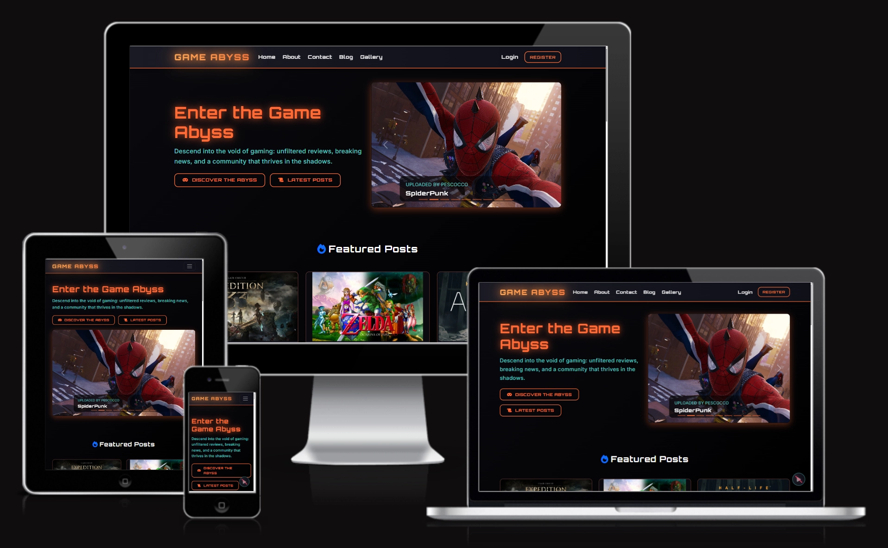
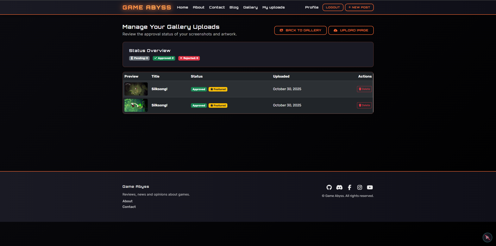
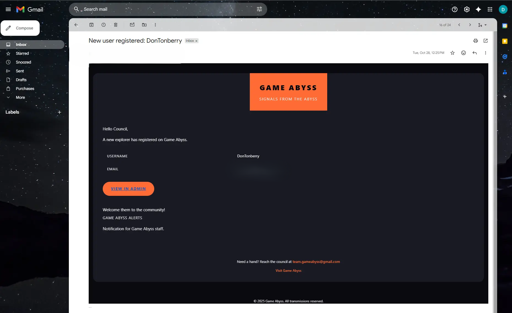
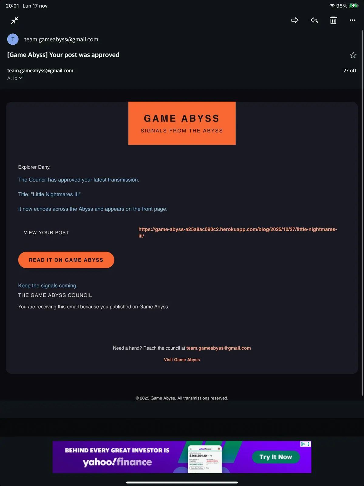



<h1 align="center">
  
  Milestone Project 3: Game Abyss
</h1>



[Live Site](https://game-abyss-a25a8ac090c2.herokuapp.com/)

Game Abyss is a simple community gaming blog. You can write posts, react to other posts, leave comments, share game images, and contact staff for help.

---

## Contents

- [Project Overview](#project-overview)
- [How Game Abyss Works](#how-game-abyss-works)
- [Feature Summary](#feature-summary)
- [User Experience Design](#user-experience-design)
- [Features](#features)
- [Technical Overview](#technical-overview)
- [Technologies Used](#technologies-used)
 - [Email System](#email-system)
- [Database Design](#database-design)
- [Testing and Bug Fixes](#testing-and-bug-fixes)
- [Running the Project Locally](#running-the-project-locally)
- [Deployment](#deployment)
- [Behind the Scenes: My Development Journey](#behind-the-scenes-my-development-journey)
- [Future Improvements](#future-improvements)
- [Credits](#credits)

---

## Project Overview

**Game Abyss** is a small community blog about games.

You can:

> Write posts, read others, react, comment, and share images.

I built it while learning Django. Instead of a throwaway demo, I wanted something real I can grow after the course.

### The Story Behind Game Abyss

For a long time I wanted a small friendly place to talk about games. Big sites felt noisy. When I learned Django I realised I could build it myself.

I kept the goal simple: a clean blog where people can write, react, and share images without clutter.

So this project mixes:

- My love for gaming since childhood
- Learning and practising Django
- A real project I can improve after the course

I chose to start small, make it work well, and then add ideas later instead of rushing many half-finished features.

### What You Get

- Write and edit posts with a rich text editor
- Account system (signup, login, password reset, email check)
- Real emails for resets and notifications
- Comments and reactions (like / love / dislike) on posts and comments
- User profiles with avatar and basic stats
- Image gallery with an "My uploads" page
- Staff tools to approve, reject, and feature content
- Dark responsive layout for mobile and desktop
- Clean admin panel (Jazzmin themed)
- Hosted on Heroku with PostgreSQL and optional Cloudinary

### Who It Is For

- Players who want to share thoughts
- Readers who want quick, honest game views
- Staff who need simple moderation
- Anyone who wants a quiet gaming corner

Every post goes through approval. Gallery uploads are checked. A help form lets users reach staff. Clear status labels show what happened to your content.

---

## How Game Abyss Works

1. Read posts and view the gallery without an account.
2. Sign up to write posts, comment, react, upload images, and edit your profile.
3. Posts start as draft or pending; staff approve or reject them.
4. You can like, love, or dislike posts and comments.
5. Upload game images; staff can mark some as featured.
6. Use the contact form to send a help request to staff.
7. Small extras: optional music, simple animations, clear focus styles.

---

## Feature Summary

### Blog

- Write posts with a rich text editor (HTML is cleaned for safety)
- Draft → Pending → Approved or Rejected flow
- Edit or delete your own posts
- Tags, excerpts, reading time auto set

### Comments & Reactions

- Add a comment (needs verified email)
- Like / Love / Dislike posts and comments (one per user)
- Report a comment if it breaks rules

### Gallery

- Upload game images (common formats, size limit)
- See and manage your uploads
- Staff can feature images for the homepage

### Profiles

- Avatar, short bio, favourite games / genres
- Update details and email
- Email must be verified for key actions

### Help & Messages

- Simple contact form
- Emails sent for approvals, rejections, reports
- Clear success / error messages across the site

### Staff Tools

- Dashboard with counts
- Approve or reject posts and comments
- Resolve reports and feature content
- Log each action for audit

### General Experience

- Dark responsive layout
- Keyboard friendly
- Optional background music
- Fast static asset serving

---

## User Experience Design

To keep this section clear and easy to scan, it’s organized in the following order:
1. User Stories
2. Site Structure
   - Site Pages Overview
3. Wireframes
4. Color Palette
5. Typography

### User Stories


I designed Game Abyss with **four types of users** in mind:

#### Casual Visitor (Unauthenticated User)
- I want to read blog posts about games without needing to create an account
- I want to browse the gallery to see gaming screenshots
- I want to understand what the site is about from the homepage
- I want to easily find and read the privacy policy and terms

#### Community Member (Authenticated User)
- I want to create an account and customize my profile
- I want to write and publish blog posts about games I love
- I want to comment on other people's posts and join discussions
- I want to like or dislike posts and comments to express my opinion
- I want to upload gaming screenshots to the gallery
- I want to mark certain games as my favorites on my profile
- I want to edit or delete my own content

#### Content Moderator (Staff User)
- I want to review flagged posts and comments quickly
- I want to approve or reject reported content with a reason
- I want to see pending content that needs moderation
- I want a clean, modern admin interface (Jazzmin)
- I want to receive email notifications about new reports

#### Site Administrator (Superuser)
- I want full control over all content and users
- I want to manage moderation actions and view logs
- I want to configure site settings and email templates
- I want to access Django admin for database management
- I want to monitor user activity and engagement

### Site Structure

Game Abyss follows a clear, intuitive navigation structure:

```
Homepage
├── About
├── Blog
│   ├── All Posts (with pagination)
│   ├── Single Post Detail
│   │   ├── Comments Section
│   │   └── Reactions (Like/Dislike)
│   └── Create New Post (authenticated)
├── Gallery
│   ├── All Images (with pagination)
│   └── Upload Image (authenticated)
├── User Profile
│   ├── View Profile (public)
│   └── Edit Profile (own profile only)
├── Authentication
│   ├── Sign Up
│   ├── Login
│   ├── Logout
│   └── Password Reset
├── Contact
└── Privacy Policy
```

The navigation bar adapts based on authentication status. Logged-out users see "Login" and "Sign Up", while logged-in users see "Profile", "Create Post", and "Logout".

#### Site Pages Overview

#### Homepage

The main landing page featuring a hero section with the site logo, latest blog posts, and featured content carousel.


#### About Page

Information about Game Abyss, its mission, and the community-driven approach to gaming content.


#### Blog Page

Browse all published blog posts with pagination, filtering by tags, and search functionality.


#### Create New Post

Rich text editor (Summernote) for creating and publishing blog posts with image uploads and tagging.


#### User Profile

Personalized profile pages showing user stats, avatar, favorite games, and published posts.


#### Gallery

Community gallery showcasing gaming screenshots and artwork uploaded by users.


#### My Uploads

Personal dashboard for users to manage their gallery submissions and track approval status.



#### Contact Page

Contact form for users to reach out to the Game Abyss team with questions or feedback.


#### Registration

Sign up form for new users to create an account with email verification.


#### Login

Secure login page for existing users to access their accounts.


#### Password Reset

Email-based password recovery flow for users who forgot their credentials.


#### Password Reset Confirmation

Confirmation page after requesting a password reset link.


### Wireframes


I sketched out wireframes for the main pages before diving into code. This helped me visualize the layout and user flow early on. Key pages included:

- **Homepage** - Hero section with featured posts, latest posts grid, and call-to-action buttons
- **Blog Post List** - Card-based grid layout with pagination controls
- **Post Detail** - Full post content, author info, reactions, and comments thread
- **User Profile** - Avatar, bio, favorite games, and user's published posts
- **Gallery** - Masonry-style image grid with lightbox viewing
- **Create Post** - Form with Summernote rich text editor for formatting

The wireframes were simple sketches, but they gave me a clear roadmap for the template structure.

**Desktop Wireframes - Windows PC (27" Display, QHD 2560x1440)**


**Mobile Wireframes - Multiple Devices**

Testing across different screen sizes: iPhone 15 Pro (6.1"), iPad Pro 12.9", and Samsung Galaxy S24 (6.2")


### Color Palette


Current palette is defined entirely via CSS custom properties in `:root` for easy global theming:

| Token | Hex / Value | Purpose |
|-------|-------------|---------|
| `--color-dark` | `#0a0a0f` | Deep background gradient base |
| `--color-surface` | `#1a1a24` | Card surfaces, modal backgrounds, elevated panels |
| `--color-primary` | `#ff6b35` | Primary accent (buttons, borders, glow effects) |
| `--color-secondary` | `#4ecdc4` | Secondary accent (focus outlines, highlights) |
| `--color-text` | `#e8e8e8` | Main body and heading text |
| `--color-text-muted` | `rgb(232 232 232 / 75%)` | Muted / secondary text and Bootstrap `--bs-secondary-color` hook |

These replace an earlier draft palette (purple/blue/green set) and better match the warm neon-orange + teal contrast used throughout the UI. Keeping them in `:root` lets me adjust theme accents quickly without hunting through component files.

The gradients (`--gradient-primary`, `--gradient-surface`, `--gradient-highlight`) and shadow/glow filters (`--shadow-*`, `--filter-glow-*`) build on this base to achieve the luminous gaming aesthetic.

### Typography


I kept typography simple and readable:

Root-level CSS custom properties centralize all font families and the fluid type scale so they can be reused consistently across components:

```css
:root {
   --font-primary: 'Rubik', sans-serif;        /* Base body text */
   --font-secondary: 'Inter', sans-serif;      /* Paragraphs, meta info */
   --font-headings: 'Orbitron', sans-serif;    /* All headings H1–H6 */
   /* ...fluid size variables (see style.css) */
}
```

I always define fonts and sizing in `:root` in my projects for convenience and maintainability. This makes it easy to adjust global typography (or theme) in a single place without hunting through multiple files.

- **Headers (H1–H6)** use `var(--font-headings)` (`Orbitron`) for a sci‑fi gaming feel.
- **Body text** uses `var(--font-primary)` (`Rubik`) for readable paragraphs.
- **Secondary text / paragraphs** (`p`) intentionally pull from `var(--font-secondary)` (`Inter`) for subtle contrast.
- **Code blocks** use the default monospace system stack.

Font weights vary between 400 (normal), 500 (medium), 600 (semibold), and 700 (bold) to create hierarchy, while the fluid clamp-based scale (`--fs-*` variables) ensures legibility from mobile to large desktop screens without loading extra responsive utilities.

---

## Features


Game Abyss is packed with features built iteratively over the development process. Here's what makes it special:

### 1. Authentication System

- **User Registration** - Sign up with email, username, and password
- **Email Verification** - Confirm email address before full access (optional, configurable)
- **Login/Logout** - Secure session management with Django
- **Password Reset** - Email-based password recovery flow
- **Social Auth Ready** - Powered by django-allauth (can add Google/GitHub login later)
- **Remember Me** - Optional persistent login sessions

### 2. User Profiles

- **Custom Profile Model** - Extended User model with additional fields
- **Avatar Uploads** - Upload profile pictures (stored in Cloudinary)
- **Bio Section** - Write a personal bio about gaming interests
- **Favorite Games** - List up to 5 favorite games on profile
- **User's Posts** - Display all published blog posts by user
- **Public Profiles** - Anyone can view user profiles and their content
- **Edit Profile** - Update bio, avatar, and favorite games

### 3. Blog System (CRUD)

- **Create Posts** - Rich text editor (Summernote) with formatting options
- **Image Uploads** - Featured images for posts (Cloudinary integration)
- **Draft/Published Status** - Save drafts or publish immediately
- **Featured Posts** - Staff can mark posts as featured for homepage
- **Edit Posts** - Authors can edit their own posts
- **Delete Posts** - Authors can delete their own posts (with confirmation)
- **Slug Generation** - Automatic URL-friendly slugs from post titles
- **Tag System** - Categorize posts with tags for easier discovery
- **Post List View** - Paginated list of all published posts
- **Post Detail View** - Full post with reactions, comments, and author info
- **Author Attribution** - Each post clearly shows who wrote it

### 4. Comments and Reactions

- **Nested Comments** - Leave comments on blog posts
- **Edit Comments** - Edit your own comments
- **Delete Comments** - Remove your own comments
- **Post Reactions** - Like or dislike blog posts
- **Comment Reactions** - Like or dislike individual comments
- **Reaction Counts** - Display total likes and dislikes
- **One Reaction Per User** - Can't spam reactions (enforced at DB level)
- **Anonymous Viewing** - See reactions without being logged in

### 5. Gallery System

- **Image Uploads** - Share gaming screenshots and artwork
- **Gallery Grid** - Masonry-style layout of all images
- **Lightbox View** - Click to view full-size images
- **Image Captions** - Add descriptions to uploaded images
- **Pagination** - Handle large numbers of images efficiently

#### Gallery Image Moderation

Gallery uploads use a simple three state workflow:

- `PENDING` - default state when a user uploads an image
- `APPROVED` - image is visible in the public gallery
- `REJECTED` - image is hidden from the gallery

At the moment, image approval is managed only through the Django admin panel.

Staff must:

1. Log into Django admin (`/admin/`)
2. Go to `Gallery` → `Gallery images`
3. Filter by `PENDING`
4. Change the status to `APPROVED` or `REJECTED`
5. Optionally mark images as `Featured` to show them on the homepage

The built in staff tools on the site do not handle gallery image approval yet. They are focused on posts, comments, and reports.

### 6. Moderation System

- **Report Posts** - Users can flag inappropriate blog posts
- **Report Comments** - Flag problematic comments for review
- **Staff Dashboard** - Moderators see pending reports in admin
- **Approve/Reject** - Staff can approve or reject reported content
- **Moderation Logs** - Track all moderation actions with reasons
- **Auto-Hide** - Heavily reported content hidden until reviewed
- **Email Notifications** - Staff receive emails about new reports

### 7. Email System

- **Welcome Emails** - New users receive welcome message after signup
- **Password Reset Emails** - Secure reset link sent via email
- **Moderation Alerts** - Staff notified about content reports
- **HTML Email Templates** - Branded, styled email templates
- **Inline CSS** - Premailer package for email client compatibility
- **SendGrid Integration** - Reliable email delivery in production

### 8. Design and UX

- **Responsive Design** - Works perfectly on mobile, tablet, and desktop
- **Bootstrap 5** - Modern, mobile-first CSS framework
- **Dark Theme** - Gaming-friendly dark color scheme
- **Toast Notifications** - Success/error messages with auto-dismiss
- **Form Validation** - Client and server-side validation for all forms
- **Loading States** - Clear feedback during async operations
- **Error Pages** - Custom 404, 403, and 500 error pages
- **Front-end polish** - Home pagination and ambient background music scripts (custom, `static/js/`) enhancing UX without bloat

### 9. Security Features

- **CSRF Protection** - Django's built-in CSRF tokens on all forms
- **SQL Injection Prevention** - Django ORM handles query escaping
- **XSS Protection** - Template auto-escaping prevents XSS attacks
- **Password Hashing** - Secure password storage with Django's hashers
- **Login Required** - Decorators protect sensitive views
- **Ownership Checks** - Users can only edit/delete their own content
- **Staff Permissions** - Moderation features restricted to staff users

### 10. Performance and Optimization

- **Database Indexing** - Optimized queries with proper indexes
- **Pagination** - Limit items per page to reduce load times
- **Static File Compression** - Whitenoise serves compressed static files
- **CDN Integration** - Cloudinary CDN for fast media delivery
- **Lazy Loading** - Images load as you scroll (native lazy loading)
- **Query Optimization** - Use of `select_related` and `prefetch_related`

---

## Technical Overview

### Structure

The project uses Django with several apps (`core`, `accounts`, `pages`, `blog`, `gallery`). Each app handles its own models, views, and templates.

### Auth

Signup, login, logout, password reset and email checks use Django Allauth. Email verification is required for posting, commenting, reacting.

### Templates & Front End

Pages are plain Django templates. Shared parts (nav, cards, pagination) are reused. Styling uses Bootstrap 5 plus custom CSS in `static/css/style.css`. Small JavaScript files add homepage paging and music controls.

### Editor

Posts use Summernote. Uploaded HTML is cleaned with Bleach before saving. Reading time and excerpts are calculated from the cleaned text.

### Media

Local files in development. Optional Cloudinary for images when configured. Removing a gallery item also removes its image.

### Email

`core/emailing.py` builds emails and inlines CSS if Premailer is available. If not, it sends a simple HTML version. Emails notify users of approvals, rejections, features, reports and help requests.

### Static Files

WhiteNoise serves static assets in production.

### Admin

Jazzmin gives a cleaner look for staff work.

### Code Quality (optional locally)

You can install dev tools (linting, formatting) from `dev-requirements.txt`.

---

## Technologies Used

### Core Web Technologies

- **HTML5** - Semantic markup for content structure
- **CSS3** - Custom styling with modern features (Grid, Flexbox, CSS Variables)
- **JavaScript (ES6+)** - Interactive features and dynamic content
- **Bootstrap 5.3** - Responsive CSS framework for layout and components

### Backend and Database

- **Python 3.13** - Primary programming language
- **Django 5.2.7** - High-level Python web framework
- **PostgreSQL** - Production database (Heroku Postgres addon)
- **SQLite** - Local development database
- **Gunicorn** - Python WSGI HTTP server for production

### Django Packages and Extensions

| Package | Version | Purpose |
|---------|---------|---------|
| `django-allauth` | 65.3.0 | Authentication (signup, login, social auth ready) |
| `django-summernote` | 0.8.20.0 | WYSIWYG rich text editor for blog posts |
| `django-crispy-forms` | 2.3 | Better form rendering with Bootstrap |
| `crispy-bootstrap5` | 2024.10 | Bootstrap 5 template pack for crispy forms |
| `django-jazzmin` | 3.0.1 | Modern, colorful admin dashboard styling |
| `django-cloudinary-storage` | 0.3.0 | Cloudinary integration for media storage |
| `whitenoise` | 6.8.2 | Simplified static file serving for Django |

### Email and Communication

- **SendGrid** - Email delivery service (production)
- **premailer** - Inline CSS in HTML emails for compatibility
- **dj-database-url** - Parse database URLs from environment variables

### Development & Testing Tools

| Tool | Version | Purpose |
|------|---------|---------|
| `pylint` | 3.3.5 | Python code linting and quality checks |
| `pylint-django` | 2.6.1 | Django-specific Pylint plugin |
| `flake8` | 7.1.1 | Python style guide enforcement (PEP 8) |
| `djlint` | 1.36.4 | Django/Jinja template linter and formatter |
| `black` | 24.10.0 | Opinionated Python code formatter |

### Deployment and Hosting

- **Heroku** - Cloud platform for app deployment
- **Cloudinary** - CDN for image and media storage
- **Git** - Version control
- **GitHub** - Code repository hosting

### Design and Media Tools

- **Balsamiq** - Wireframing tool for initial layouts
- **Coolors** - Color palette generator
- **Font Awesome** - Icon library
- **Google Fonts** - Web typography (system fonts used for performance)

---

## Email System

This section explains how Game Abyss sends and receives emails for both internal staff awareness and user interactions. It is designed to keep moderators informed about site activity while delivering branded, helpful messages to end users.

### Admin and Site Notifications

The project uses the inbox `team.gameabyss@gmail.com` as the central address for the Game Abyss team. This mailbox receives automatically generated notification emails when key events occur, helping staff stay aware of anything that may require review or action. Typical internal notification triggers include:

- A new user completes registration.
- A user submits a new blog post for review (pending/needs moderation).
- A user publishes content that enters a moderation workflow (e.g. first-time author, flagged criteria).
- (Optional) A help or contact request is submitted through the site’s support/contact form.

These notifications focus on surfacing new registrations and potentially actionable content so staff can quickly moderate, approve, reject, or follow‑up without constantly checking the admin interface.

Admin notification example:



### User Facing Emails via SendGrid

Outbound emails to end users are delivered through a SendGrid backend configured in Django settings (using environment variables for API keys/SMTP credentials). All user emails are HTML-based and rendered from templates to maintain Game Abyss branding (colors, typography, and consistent layout). Where available, CSS is inlined (Premailer) to improve compatibility across email clients.

Automatic user-facing email types include:

- Email verification message containing a confirmation link after registration.
- Password reset emails with secure time-limited links.
- Post approval confirmation when staff publish a previously pending blog post.
- (Optional) Rejection or moderation decision emails clarifying why a submission was not approved.
- (Optional) Follow‑up or resolution notices regarding reported comments or help requests.

Each email is triggered by specific application events (e.g. registration save, post status transition, moderation action). The sending logic assembles context, selects the appropriate HTML template, and (if available) runs it through the inlining pass before dispatch. This ensures both reliability (via SendGrid) and consistent presentation.

User confirmation email example:



---

## Database Design

Game Abyss uses **PostgreSQL in production** (Heroku) and **SQLite for local development**. The database schema is designed to support all features efficiently.

### Entity Relationship Overview

The database consists of **8 main models** spread across different apps:

1. **User** (Django built-in) - Authentication and basic user info
2. **UserProfile** (accounts app) - Extended user information
3. **BlogPost** (blog app) - Blog articles with status and metadata
4. **Comment** (blog app) - User comments on blog posts
5. **PostReaction** (blog app) - Likes/dislikes on posts
6. **CommentReaction** (blog app) - Likes/dislikes on comments
7. **CommentReport** (blog app) - User reports for moderation
8. **GalleryImage** (gallery app) - Uploaded gaming images

### Key Relationships

- **User to UserProfile**: One-to-One (each user has exactly one profile)
- **User to BlogPost**: One-to-Many (users can write multiple posts)
- **BlogPost to Comment**: One-to-Many (posts can have multiple comments)
- **User to Comment**: One-to-Many (users can leave multiple comments)
- **User to PostReaction**: One-to-Many (users can react to multiple posts)
- **BlogPost to PostReaction**: One-to-Many (posts can have multiple reactions)
- **User to CommentReaction**: One-to-Many (users can react to multiple comments)
- **Comment to CommentReaction**: One-to-Many (comments can have multiple reactions)
- **Comment to CommentReport**: One-to-Many (comments can be reported multiple times)
- **User to GalleryImage**: One-to-Many (users can upload multiple images)

### Model Schemas

**UserProfile Model** (`accounts/models.py`)
```
- user (OneToOneField to User)
- bio (TextField, optional)
- avatar (CloudinaryField, optional)
- favorite_game_1 through favorite_game_5 (CharField, optional)
- created_at (DateTimeField, auto)
- updated_at (DateTimeField, auto)
```

**BlogPost Model** (`blog/models.py`)
```
- title (CharField, max 200)
- slug (SlugField, unique)
- author (ForeignKey to User)
- content (TextField, rich text via Summernote)
- excerpt (TextField, optional)
- image (CloudinaryField, optional)
- status (CharField: draft/published)
- featured (BooleanField, default False)
- tags (CharField, optional)
- created_at (DateTimeField, auto)
- updated_at (DateTimeField, auto)
- published_at (DateTimeField, nullable)
```

**Comment Model** (`blog/models.py`)
```
- post (ForeignKey to BlogPost)
- author (ForeignKey to User)
- body (TextField)
- created_at (DateTimeField, auto)
- updated_at (DateTimeField, auto)
- is_edited (BooleanField, default False)
```

**PostReaction Model** (`blog/models.py`)
```
- user (ForeignKey to User)
- post (ForeignKey to BlogPost)
- reaction_type (CharField: like/dislike)
- created_at (DateTimeField, auto)
- Unique constraint: (user, post)
```

**CommentReaction Model** (`blog/models.py`)
```
- user (ForeignKey to User)
- comment (ForeignKey to Comment)
- reaction_type (CharField: like/dislike)
- created_at (DateTimeField, auto)
- Unique constraint: (user, comment)
```

**CommentReport Model** (`blog/models.py`)
```
- comment (ForeignKey to Comment)
- reporter (ForeignKey to User)
- reason (TextField)
- status (CharField: pending/reviewed/dismissed)
- reviewed_by (ForeignKey to User, nullable)
- reviewed_at (DateTimeField, nullable)
- created_at (DateTimeField, auto)
```

**GalleryImage Model** (`gallery/models.py`)
```
- title (CharField, max 200)
- image (CloudinaryField)
- caption (TextField, optional)
- uploaded_by (ForeignKey to User)
- created_at (DateTimeField, auto)
```

---

## Testing and Bug Fixes

Testing was a **huge focus** throughout development. I wanted to make sure every feature worked correctly and handled edge cases gracefully.

**For detailed testing documentation, see [TESTING.md](TESTING.md)**

The testing documentation includes test coverage breakdowns, bug reports with fixes, validation screenshots, and user testing feedback.

### Notable Bug Fixes

Below are issues solved during development. Each entry links directly to an observed problem, the root cause, and the implemented fix.

#### 1. Blog Post Slug Collisions / Confusing URLs

**Problem**: Slugs were date-scoped only (`unique_for_date='published_at'`). Two drafts or pending posts created the same day with identical titles produced repetitive long slugs containing the date and numeric suffixes, and moving a post between draft/published states could shift which queryset was used for collision checks.

Original field + generation logic excerpt:

```python
slug = models.SlugField(
   max_length=120,
   unique_for_date='published_at',
   blank=True,
   editable=False,
)
# In save(): builds base like f"{base}-{date_str}" then only checks posts on that same date
```

**Fix**: Made slug globally unique (`unique=True`) and replaced the date-scoped approach with a simple incremental suffix loop that trims intelligently.

New field + generation logic excerpt:

```python
slug = models.SlugField(
   max_length=120,
   unique=True,
   blank=True,
   editable=False,
)
# In save():
base_slug = slugify(self.title)[: slug_field.max_length] or 'post'
unique_slug = base_without_suffix
counter = 2
while existing.filter(slug=unique_slug).exists():
   unique_slug = f"{trimmed_base}-{counter}"  # ensures global uniqueness
```

**Result**: Stable, human-friendly slugs that no longer depend on publication date and avoid rare edge collisions when status changes.

#### 2. Draft Posts Exposing Engagement (Reactions & Comments Visible)

**Problem**: Draft posts displayed reaction buttons and the full comments interface. Users could interact with content not yet approved, creating moderation and leakage issues.

Original template fragment:

```django
<!-- Always rendered -->
<section class="mt-4">
   <h3>Post Reactions</h3>
   ... reaction forms ...
</section>
<section class="mt-5">
   <h2>Comments</h2>
   ... comment list & form ...
</section>
```

**Fix**: Introduced `is_draft` check in the view and a `show_engagement = not is_draft` flag. Template now renders reactions and comments only when `show_engagement` is true.

View logic excerpt:

```python
is_draft = post.status == BlogPost.STATUS_DRAFT
show_engagement = not is_draft
if show_engagement:
      # build comment_form, reaction displays
```

Template now wraps those sections with ` ... ` (omitted here for brevity).

**Result**: Drafts are private to the author/staff; no premature engagement data leaks.

#### 3. Role Badge Inconsistency (Multiple Badges & Rarity Token)

**Problem**: Profile pages could show a "rarity" badge plus both Staff and Superuser badges simultaneously, leading to clutter and inconsistent semantics.

Original snippet:

```django
<span class="comp-badge bg-primary text-dark fw-bold">{{ rarity }}</span>

   <span class="comp-badge bg-info text-dark">Staff</span>


   <span class="comp-badge bg-warning text-dark">Superuser</span>

```

**Fix**: Simplified logic superusers show only `SUPERUSER`, staff users show only `STAFF`, regular users show nothing. Removed the extra rarity badge.

Fixed snippet:

```django

   <span class="comp-badge bg-warning text-dark">SUPERUSER</span>

   <span class="comp-badge bg-info text-dark">STAFF</span>

```

**Result**: Clear single-role representation; UI less noisy.

#### 4. Custom Error Pages Not Rendering (Missing 404 & 500 Handlers)

**Problem**: Only `handler403` was registered. Custom templates for 404 and 500 never appeared; Django defaults were served.

Original `core/urls.py` tail:

```python
handler403 = "core.views.permission_denied_view"
```

Original `core/views.py` only defined `permission_denied_view`.

**Fix**: Added missing handlers and view functions.

Updated `core/urls.py` tail:

```python
handler403 = "core.views.permission_denied_view"
handler404 = "core.views.page_not_found_view"
handler500 = "core.views.server_error_view"
```

Updated `core/views.py` excerpt:

```python
def page_not_found_view(request, exception):
   return render(request, "errors/404.html", status=404)

def server_error_view(request):
   return render(request, "errors/500.html", status=500)
```

**Result**: All error states consistently use branded templates improving UX and transparency.

---

Each fix was accompanied by targeted test adjustments or new tests (e.g. profile badge rendering, slug generation uniqueness, draft access rules, error handler resolution) ensuring regressions are caught early.

---

## Running the Project Locally

1. **Clone and set up Python.** Use Python 3.13 (the version used for automated tests) and create a virtual environment.
   ```bash
   git clone https://github.com/<your-username>/Game-Abyss.git
   cd Game-Abyss
   python -m venv .venv
   source .venv/bin/activate  # On Windows use .venv\\Scripts\\activate
   ```
2. **Install dependencies.**
   ```bash
   pip install --upgrade pip
   pip install -r requirements.txt
   pip install -r dev-requirements.txt  # optional helpers for formatting/tests
   ```
   To use the optional lint scripts, also run `npm install`.
3. **Configure environment variables.** Create an `env.py` (loaded by `core/settings.py`) or export variables in your shell:
   ```python
   import os
   os.environ.setdefault("SECRET_KEY", "dev-secret")
   os.environ.setdefault("DEBUG", "True")
   os.environ.setdefault("SITE_DOMAIN", "localhost:8000")
   os.environ.setdefault("DEFAULT_FROM_EMAIL", "Game Abyss <dev@example.com>")
   os.environ.setdefault("PRIMARY_SUPERADMIN_EMAIL", "dev@example.com")
   ```
   Optional variables:
   - `DATABASE_URL` for PostgreSQL
   - `CLOUDINARY_URL` or `CLOUDINARY_CLOUD_NAME` + API keys for hosted media
   - `SENDGRID_API_KEY` or SMTP credentials (`EMAIL_HOST`, `EMAIL_HOST_USER`, `EMAIL_HOST_PASSWORD`, etc.)
   - `ALLOWED_HOSTS`, `SITE_BASE_URL`, and `SUPPORT_EMAIL` for production-friendly URLs
   - `BLOG_COMMENT_BANNED_WORDS` and `BLOG_COMMENT_MAX_LINKS` to tune moderation rules
4. **Prepare the database and run the server.**
   ```bash
   python manage.py migrate
   python manage.py createsuperuser  # optional but recommended for admin access
   python manage.py runserver
   ```
5. **Access the site.** Visit `http://localhost:8000/` and log in with your created account. Use the Django admin (`/admin/`) for staff controls.

---

## Deployment

### Fork and clone this repository

If you plan to contribute or customize your own copy:

1. Fork on GitHub
    - Open the repository page and click "Fork" to create your copy under your account.
2. Clone your fork locally
    - Replace <your-username> with your GitHub handle:
       - `git clone https://github.com/<your-username>/Game-Abyss.git`
       - `cd Game-Abyss`
3. (Optional) Keep your fork up to date
    - Add the original repository as `upstream`:
       - `git remote add upstream https://github.com/Drake-Designer/Game-Abyss.git`
    - Pull updates later with:
       - `git fetch upstream`
       - `git merge upstream/main`

The reference deployment uses Heroku with PostgreSQL, Cloudinary, and SendGrid.

1. **Create the Heroku app.** Provision a PostgreSQL add-on and, if needed, a Cloudinary account.
2. **Set config vars.** At minimum provide `SECRET_KEY`, `DATABASE_URL` (auto-set by Heroku Postgres), `ALLOWED_HOSTS`, `SITE_DOMAIN`, `PRIMARY_SUPERADMIN_EMAIL`, `DEFAULT_FROM_EMAIL`, and your email backend credentials (`SENDGRID_API_KEY` or SMTP settings). Add Cloudinary credentials when using hosted media.
3. **Push the code.** Heroku installs `requirements.txt`, runs `python manage.py collectstatic` through WhiteNoise, and executes migrations via the `release` command in `Procfile`.
4. **Create admin users.** Run `heroku run python manage.py createsuperuser` to seed moderation accounts. Staff can then operate through the Jazzmin-themed admin or the built-in staff dashboard.

The `Procfile` configures Gunicorn for web serving and runs migrations on each release.

---

## Behind the Scenes: My Development Journey

Building Game Abyss was an **iterative process**. I didn't build everything at once. Instead, I tackled features one at a time, committed changes frequently, and learned from mistakes along the way.

### The Iterative Philosophy

I followed a simple approach:

1. **Plan a feature** - Write down what I need and why
2. **Build the MVP** - Get the core functionality working first
3. **Test thoroughly** - Write tests and manually verify everything works
4. **Refine and polish** - Improve UX, add validation, handle edge cases
5. **Commit and move on** - Git commit, then start the next feature

This kept me from getting overwhelmed and ensured each piece was solid before moving forward.

### Challenges

**1. Email styles missing in Gmail**
Gmail removed my `<style>` block, so emails looked plain.
Solution: Use Premailer to turn CSS into inline styles. If Premailer is not installed, send the HTML with a simple embedded style tag.

**2. Double reactions**
Fast clicks could save two reactions.
Solution: Add a database unique rule (one reaction per user per post/comment). Duplicate attempts fail cleanly.

**3. Unsafe pasted HTML**
Users could paste risky tags.
Solution: Clean all post HTML on save with Bleach using a short allow list.

**4. Large Heroku build**
All dev packages were installed, making the slug huge.
Solution: Separate production requirements from development ones.

### Continuous Learning

Every challenge taught me something new. I learned about:

- Email client compatibility and inline CSS
- Database constraints and integrity
- XSS prevention and sanitization
- Heroku deployment optimization
- Django signals for automated tasks
- Testing strategies (unit, integration, manual)

Building Game Abyss wasn't just about writing code. It was about **problem-solving, researching, and growing as a developer**.

---


## Future Improvements

Possible next steps:

1. Avatar cropping tool
2. Small staff bar showing pending counts
3. Search for posts by title/text/tag
4. User badges for milestones
5. In-site notifications (new comment, reaction)
6. Follow users and view a follow feed
7. Game API lookups for favourite games
8. Embed video/audio links in posts
9. Add gallery image approval to the in site staff tools so moderators can review and approve uploads without using Django admin

I skipped these to keep scope small and finish a stable base first.

---

## Credits

Building Game Abyss was a learning journey, and I relied on countless resources, communities, and tools along the way. Here's a big thank you to everyone and everything that helped:

### Frameworks & Libraries

- **Django** - High-level Python web framework: [docs.djangoproject.com](https://docs.djangoproject.com/)
- **Django Allauth** - Authentication and user management: [django-allauth.readthedocs.io](https://django-allauth.readthedocs.io/)
- **Django Summernote** - Rich text editor integration
- **Bleach** - HTML sanitization library
- **Jazzmin** - Modern Django admin interface styling
- **Bootstrap 5** - Responsive CSS framework: [getbootstrap.com/docs](https://getbootstrap.com/docs/)
- **Font Awesome** - Icon library for UI elements
- **WhiteNoise** - Simplified static file serving

### Infrastructure & Services

- **Heroku** - Cloud platform for app deployment
- **PostgreSQL** - Production database (Heroku Postgres)
- **Cloudinary** - CDN for image and media storage: [cloudinary.com/documentation/django_integration](https://cloudinary.com/documentation/django_integration)
- **SendGrid** - Email delivery service
- **GitHub** - Version control and code hosting

### Development Tools

- **VS Code** - Code editor with Django extensions
- **Pylint** - Python code quality and linting
- **Flake8** - Python style guide enforcement (PEP 8)
- **djlint** - Django/Jinja template linter and formatter
- **Black** - Opinionated Python code formatter

### Design Resources

- **Coolors.co** - Color palette generator
- **Unsplash** - Stock images and placeholder content
- **Balsamiq** - Wireframing tool for initial layouts

### Learning Resources

- **Code Institute** - Full Stack Developer Course and learning platform
- **Corey Schafer's Django Tutorials** - YouTube series for Django fundamentals
- **Real Python** - In-depth articles on Django, testing, and deployment
- **Udemy Django Courses** - Comprehensive Django courses including Python and Django Full Stack Web Developer Bootcamp, and Django 4 and Python Full-Stack Developer Masterclass
- **MDN Web Docs** - Reference for HTML, CSS, and JavaScript
- **Stack Overflow** - Community Q&A for troubleshooting
- **Django Forum** - Official Django community discussions
- **Reddit (r/django)** - Django developer community

### Validation Tools

- **W3C Markup Validator** - HTML validation
- **W3C CSS Validator** - CSS validation
- **Lighthouse** - Performance and accessibility audits
- **WAVE** - Web accessibility evaluation

### Special Thanks

- **Jubril Akolade** ([LinkedIn](https://www.linkedin.com/in/jubrilakolade/)) - Mentor who reviewed the project and gave very helpful guidance leading to several improvements before submission. His suggestions included: adding clear fork & clone instructions in the Deployment section, personalising all delete post alerts and user/admin confirmation messages across the site, and fixing the DESIGN section layout by arranging elements in the correct order.

- **Lewis Dillon** ([GitHub](https://github.com/LewisMDillon) | [LinkedIn](https://www.linkedin.com/in/lewis-dillon/)) - Who reviewed the site, helped with content, provided valuable feedback, and served as a staff member to test moderation features. Thank you for pushing me to improve!

- **Andrea Contarino** ([GitHub](https://github.com/andconta) | [LinkedIn](https://www.linkedin.com/in/andreacontarino/)) - Senior Software Engineer who provided invaluable advice on code implementation, site structure, and best practices. Also tested the site as a staff member. Your expertise made a huge difference!

#### Andrea Contarino – Advanced DEBUG Configuration Support

Andrea Contarino not only guided me on architecture, code cleanliness, and Django best practices, but also significantly improved the automatic handling of `DEBUG`. His solution prevents common mistakes (accidentally leaving `DEBUG=True` in production or forgetting to enable it locally) and saved me considerable time during fast build–test cycles.

The approach relies on a single environment variable (`DEBUG`). Locally it defaults to `True` (so no manual toggle is needed), while on Heroku I explicitly set `DEBUG=False`. This removes noisy commits, reduces the risk of exposing sensitive details (full tracebacks, debug panels), and keeps deployment friction low.

Exact snippet from `core/settings.py` powering the automatic configuration:

```python
# Security / Environment flags
SECRET_KEY = os.environ.get("SECRET_KEY")
DEBUG = os.environ.get("DEBUG", "True") == "True"

# Protocol derived from DEBUG: force HTTPS in production
ACCOUNT_DEFAULT_HTTP_PROTOCOL = "https" if not DEBUG else "http"
```

How it behaves in practice:

1. Local development: no need to set `DEBUG` → it stays `True` by default.
2. Heroku deployment: set config var `DEBUG=False` → production runs safely.
3. Allauth protocol automatically aligns (HTTP locally, HTTPS in production).

Direct benefits:

- No manual toggling before deploy
- Lower risk of leaking stack traces or debug info
- Cleaner Pull Requests (fewer incidental setting changes)
- Clear, centralized intent (environment controls runtime mode)

Thank you Andrea for the elegant solution and the time you invested in reviews and optimizations—it made the build–test–deploy workflow smoother and more reliable.

- **Giuseppe Strano** ([GitHub](https://github.com/zupeppe)) - Beta tester who thoroughly tested the site from a user perspective, posted game reviews, and provided great feedback on the user experience.

- **Luca Di Blasi** ([LinkedIn](https://www.linkedin.com/in/luca-di-blasi-b21544a3/)) - Beta tester who tested the site as a user, uploaded photos to the gallery, and posted game reviews, helping me test multiple features.

- **Rita Perrone** ([LinkedIn](https://www.linkedin.com/in/rita-perrone-9aa7aaa2/)) - Beta tester who tested the site from a user perspective, contributed photos to the gallery, and posted game reviews, providing valuable real-world testing data.

- **Giuseppe Aguglia** ([LinkedIn](https://www.linkedin.com/in/giuseppe-aguglia/)) - Beta tester who tested the site as a user and posted game reviews, helping verify the complete user workflow.

### Additional Notes

- **Frameworks & libraries:** Django, Django Allauth, Django Summernote, Bleach, Jazzmin, Bootstrap 5, Font Awesome, WhiteNoise.
- **Media & tooling:** Cloudinary (optional media storage), SendGrid-compatible SMTP for transactional email.
- **Front-end polish:** Home pagination and background music scripts are bespoke and live in `static/js/`.
- **Team & inspiration:** Thanks to the Game Abyss community testers and mentors who provided feedback during development.

All other assets (including the favicon, hero art, and bundled audio theme) ship with this repository. Replace them with your own licensed media if you fork the project.

User-uploaded images in the gallery are the property of their respective uploaders. Gaming-related content and imagery used for educational purposes only.

---

**Thank you for checking out Game Abyss!**

If you have any questions or feedback, feel free to reach out. Happy gaming! 🎮

Made with ❤️ by [Drake-Designer](https://github.com/Drake-Designer)

