

<h1 align="center">
  
  Milestone Project 4: Game Abyss
</h1>

<p align="center">
  <em><strong>
    A community-driven gaming blog built with Django and PostgreSQL.<br>
    Share reviews, discover new games, and join the conversation!
  </strong></em>
</p>

---

##  [Visit Game Abyss Live](https://game-abyss-a25a8ac090c2.herokuapp.com/)

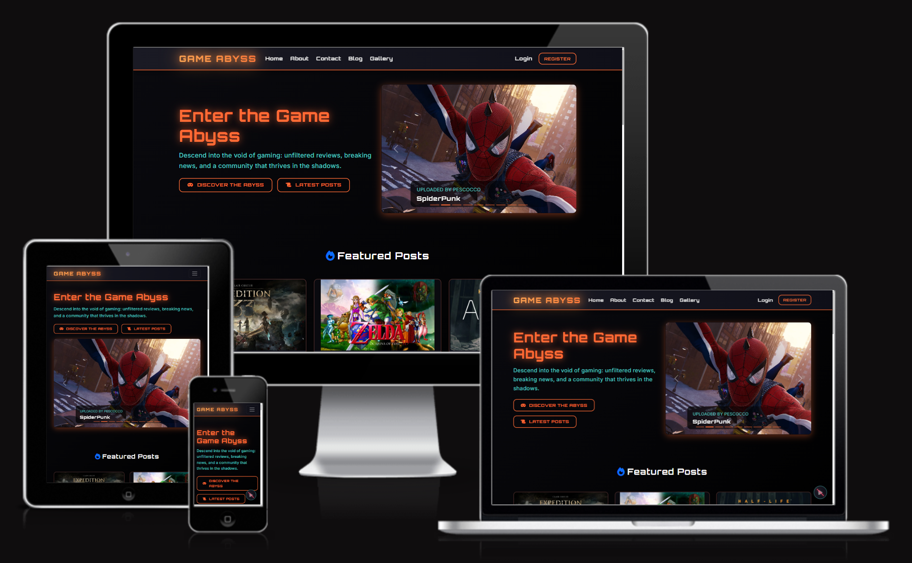

---

## Table of Contents

1. [Project Overview](#project-overview)
2. [How Game Abyss Evolved](#how-game-abyss-evolved)
3. [How I Split the Project into Apps](#how-i-split-the-project-into-apps)
4. [User Experience Design](#user-experience-design)
   - [User Stories](#user-stories)
   - [Site Structure](#site-structure)
   - [Wireframes](#wireframes)
   - [Color Palette](#color-palette)
   - [Typography](#typography)
5. [Features](#features)
6. [Database Design](#database-design)
7. [Technologies Used](#technologies-used)
8. [Testing and Bug Fixes](#testing-and-bug-fixes)
9. [Behind the Scenes: My Development Journey](#behind-the-scenes-my-development-journey)
10. [Future Improvements](#future-improvements)
11. [Deployment](#deployment)
    - [Local Development Setup](#local-development-setup)
    - [Heroku Deployment](#heroku-deployment)
12. [Credits](#credits)

---

## Project Overview

Welcome to **Game Abyss!**

A modern, community-driven gaming blog platform designed for gamers, by gamers. Whether you're a casual player or a hardcore enthusiast, Game Abyss is your space to:

> Share your thoughts, read reviews, discover new games, and connect with fellow gamers from around the world!

### The Story Behind Game Abyss

Here's the truth: **I've wanted to create a gaming blog for ages!**

For years, I've been thinking: _"Wouldn't it be cool to have my own gaming community where people can share reviews, discuss their favorite games, and just... talk about gaming?"_ But I never knew where to start or how to build it.

Then came my journey with **Python and Django** through the Code Institute course, and suddenly everything clicked! 🎯

I realized: _"Wait a minute... I'm literally learning exactly what I need to build that blog I've always wanted!"_

So instead of creating just another practice project to tick off the assessment requirements, I thought: **"Why not make this count? Why not build something I actually care about and can continue developing after graduation?"**

And that's how Game Abyss was born! 🚀

This project is my way of combining:

- ✅ My passion for gaming (I've been a gamer since I was a kid!)
- ✅ My newly acquired Python and Django skills
- ✅ My long-term dream of running a gaming community
- ✅ A real-world portfolio project I'm genuinely proud of

The best part? This isn't just a one-and-done academic project. I'm already thinking about features to add in the future, like better profile image cropping, improved staff moderation tools, and much more. Game Abyss is just getting started! 💪

### What Game Abyss Offers

- **Full Blog System**: Create, edit, delete, and publish blog posts with rich text editing (Django Summernote)
- **User Authentication**: Secure registration, login, and password reset via Django Allauth with email verification
- **Professional Email System**: Real password reset and notification emails via SendGrid (not just console output!)
- **Comment & Reaction System**: Engage with posts through comments, likes, loves, and reactions
- **User Profiles**: Personalized profile pages showing stats, activity, favorite games, and genres
- **Gallery System**: Upload and share gaming screenshots and artwork
- **Moderation Tools**: Staff dashboard for content approval, comment management, and moderation logs
- **Responsive Design**: Beautiful dark theme that works perfectly on desktop, tablet, and mobile
- **Admin Dashboard**: Elegant Django admin panel styled with Jazzmin for easy content management
- **Production-Ready**: Deployed on Heroku with PostgreSQL, Cloudinary, and WhiteNoise

### Target Audience

Game Abyss is built for:

- **Gamers** who want to share their gaming experiences, reviews, and opinions
- **Players** looking for honest reviews and recommendations from real people (not just critics!)
- **Gaming enthusiasts** who enjoy community discussions and debates
- **Content creators** who want a platform for their gaming content
- **Anyone** who loves games and wants to be part of a friendly, welcoming community

---

## How Game Abyss Evolved

One of the most exciting parts of building Game Abyss was watching it grow organically, commit after commit. I didn't plan every feature upfront - instead, I let the project evolve naturally as I learned more about Django and got new ideas.

Here's how Game Abyss came to life:

### Phase 1: The Foundation

- **Basic Django Setup**: Started with the core project structure, apps, and basic templates
- **User Authentication**: Integrated Django Allauth for registration, login, and password reset
- **Email System**: Set up SendGrid for real email delivery (not just console!)
- **Blog Models**: Created the `BlogPost` model with title, body, slug, author, and timestamps
- **Responsive Layout**: Built the dark-themed UI with Bootstrap and custom CSS

### Phase 2: Growing the Blog

- **Rich Text Editor**: Added Django Summernote for beautiful post editing
- **Draft System**: Implemented draft/pending/approved/rejected status workflow
- **Slug Generation**: Made slugs globally unique and automatic based on post titles
- **Featured Posts**: Added ability to feature posts on the homepage
- **Tags System**: Created tag parsing, normalization, and filtering
- **Reading Time**: Auto-calculated reading time based on word count
- **Pagination**: Added elegant pagination for posts with carousel-style featured section

### Phase 3: User Engagement

- **Comments**: Built a full comment system with moderation
- **Reactions**: Added like/love/dislike reactions for posts and comments
- **Comment Reports**: Let users report inappropriate comments
- **User Profiles**: Created personalized profile pages with stats and activity
- **Avatar Upload**: Added profile picture uploads with default fallback
- **Favorite Games & Genres**: Let users showcase their gaming interests
- **Profile Badges**: Visual badges for staff and super admin users

### Phase 4: Content Management

- **Gallery App**: Built a separate app for screenshots and artwork
- **Moderation Dashboard**: Created staff tools for approving content
- **Moderation Logs**: Added audit trail of all moderation actions
- **Email Notifications**: Sent styled HTML emails when posts get approved/rejected
- **Draft Management**: Let authors view and manage their draft, pending, and approved posts
- **Post Editing**: Added full edit capabilities with status transitions

### Phase 5: Polish & Security

- **Access Control**: Restricted editing to post owners, deleting to staff/admins
- **Email Verification**: Required verified email for sensitive actions (posting, commenting, reacting)
- **Password Confirmation**: Added password check before account deletion
- **Profile Visibility**: Made profiles visible only to logged-in users with proper permissions
- **Error Pages**: Custom 403, 404, and 500 error templates matching site design
- **Code Quality**: Achieved **10/10 Pylint score** across all apps with comprehensive documentation

### Phase 6: Professional Touches

- **Jazzmin Admin**: Styled the Django admin panel to look modern and professional
- **Cloudinary Integration**: Moved media files to cloud storage for scalability
- **WhiteNoise**: Optimized static file serving for production
- **Custom Email Templates**: Beautiful HTML emails with inline CSS via Premailer
- **Comprehensive Testing**: Wrote **76 unit tests** with **100% pass rate**
- **HTML/CSS/Python Validation**: All code validated and compliant with W3C and PEP 8 standards

### Smart Dependency Management

One decision I'm particularly proud of is how I organized the project dependencies:

I created **two separate requirements files**:

1. **`requirements.txt`** - Contains only production dependencies needed to run the site on Heroku (Django, gunicorn, database drivers, etc.)
2. **`dev-requirements.txt`** - Contains development tools (Pylint, Flake8, djlint, formatters, testing tools, etc.)

This approach keeps the Heroku deployment **lean and fast**, while giving me all the dev tools I need locally. It's a simple but effective way to optimize both environments!

When deploying to Heroku, only `requirements.txt` is installed, which reduces build time, memory usage, and keeps the slug size small. Locally, I can install both files to get the full development experience.

### The Jazzmin Choice

Early on, I decided to use **django-jazzmin** to style the admin panel. Why? Because the default Django admin, while functional, looks pretty bland and outdated. I wanted staff and moderators to **enjoy** using the admin dashboard, not dread it!

Jazzmin transformed the admin from a boring gray interface into a modern, colorful, and intuitive dashboard that matches the Game Abyss aesthetic. It was a small addition that made a huge difference in the overall feel of the project.

Plus, it made content moderation feel less like a chore and more like actually managing a professional platform!

---

### The Story Behind Game Abyss

Here's the truth: **I've wanted to create a gaming blog for ages!**

For years, I've been thinking: _"Wouldn't it be cool to have my own gaming community where people can share reviews, discuss their favorite games, and just... talk about gaming?"_ But I never knew where to start or how to build it.

Then came my journey with **Python and Django** through the Code Institute course, and suddenly everything clicked! 🎯

I realized: _"Wait a minute... I'm literally learning exactly what I need to build that blog I've always wanted!"_

So instead of creating just another practice project to tick off the assessment requirements, I thought: **"Why not make this count? Why not build something I actually care about and can continue developing after graduation?"**

And that's how Game Abyss was born! 🚀

This project is my way of combining:

- ✅ My passion for gaming (I've been a gamer since I was a kid!)
- ✅ My newly acquired Python and Django skills
- ✅ My long-term dream of running a gaming community
- ✅ A real-world portfolio project I'm genuinely proud of

The best part? This isn't just a one-and-done academic project. I'm already thinking about features to add in the future, like better profile image cropping, improved staff moderation tools, and much more. Game Abyss is just getting started! 💪

### What Game Abyss Offers

- **Full Blog System**: Create, edit, delete, and publish blog posts with rich text editing (Django Summernote)
- **User Authentication**: Secure registration, login, and password reset via Django Allauth with email verification
- **Professional Email System**: Real password reset and notification emails via SendGrid (not just console output!)
- **Comment & Reaction System**: Engage with posts through comments, likes, loves, and reactions
- **User Profiles**: Personalized profile pages showing stats, activity, favorite games, and genres
- **Gallery System**: Upload and share gaming screenshots and artwork
- **Moderation Tools**: Staff dashboard for content approval, comment management, and moderation logs
- **Responsive Design**: Beautiful dark theme that works perfectly on desktop, tablet, and mobile
- **Admin Dashboard**: Elegant Django admin panel styled with Jazzmin for easy content management
- **Production-Ready**: Deployed on Heroku with PostgreSQL, Cloudinary, and WhiteNoise

### Target Audience

Game Abyss is built for:

- **Gamers** who want to share their gaming experiences, reviews, and opinions
- **Players** looking for honest reviews and recommendations from real people (not just critics!)
- **Gaming enthusiasts** who enjoy community discussions and debates
- **Content creators** who want a platform for their gaming content
- **Anyone** who loves games and wants to be part of a friendly, welcoming community

---

## How Game Abyss Evolved

One of the most exciting parts of building Game Abyss was watching it grow organically, commit after commit. I didn't plan every feature upfront - instead, I let the project evolve naturally as I learned more about Django and got new ideas.

Here's how Game Abyss came to life:

### Phase 1: The Foundation

- **Basic Django Setup**: Started with the core project structure, apps, and basic templates
- **User Authentication**: Integrated Django Allauth for registration, login, and password reset
- **Email System**: Set up SendGrid for real email delivery (not just console!)
- **Blog Models**: Created the `BlogPost` model with title, body, slug, author, and timestamps
- **Responsive Layout**: Built the dark-themed UI with Bootstrap and custom CSS

### Phase 2: Growing the Blog

- **Rich Text Editor**: Added Django Summernote for beautiful post editing
- **Draft System**: Implemented draft/pending/approved/rejected status workflow
- **Slug Generation**: Made slugs globally unique and automatic based on post titles
- **Featured Posts**: Added ability to feature posts on the homepage
- **Tags System**: Created tag parsing, normalization, and filtering
- **Reading Time**: Auto-calculated reading time based on word count
- **Pagination**: Added elegant pagination for posts with carousel-style featured section

### Phase 3: User Engagement

- **Comments**: Built a full comment system with moderation
- **Reactions**: Added like/love/dislike reactions for posts and comments
- **Comment Reports**: Let users report inappropriate comments
- **User Profiles**: Created personalized profile pages with stats and activity
- **Avatar Upload**: Added profile picture uploads with default fallback
- **Favorite Games & Genres**: Let users showcase their gaming interests
- **Profile Badges**: Visual badges for staff and super admin users

### Phase 4: Content Management

- **Gallery App**: Built a separate app for screenshots and artwork
- **Moderation Dashboard**: Created staff tools for approving content
- **Moderation Logs**: Added audit trail of all moderation actions
- **Email Notifications**: Sent styled HTML emails when posts get approved/rejected
- **Draft Management**: Let authors view and manage their draft, pending, and approved posts
- **Post Editing**: Added full edit capabilities with status transitions

### Phase 5: Polish & Security

- **Access Control**: Restricted editing to post owners, deleting to staff/admins
- **Email Verification**: Required verified email for sensitive actions (posting, commenting, reacting)
- **Password Confirmation**: Added password check before account deletion
- **Profile Visibility**: Made profiles visible only to logged-in users with proper permissions
- **Error Pages**: Custom 403, 404, and 500 error templates matching site design
- **Code Quality**: Achieved **10/10 Pylint score** across all apps with comprehensive documentation

### Phase 6: Professional Touches

- **Jazzmin Admin**: Styled the Django admin panel to look modern and professional
- **Cloudinary Integration**: Moved media files to cloud storage for scalability
- **WhiteNoise**: Optimized static file serving for production
- **Custom Email Templates**: Beautiful HTML emails with inline CSS via Premailer
- **Comprehensive Testing**: Wrote **76 unit tests** with **100% pass rate**
- **HTML/CSS/Python Validation**: All code validated and compliant with W3C and PEP 8 standards

### Smart Dependency Management

One decision I'm particularly proud of is how I organized the project dependencies:

I created **two separate requirements files**:

1. **`requirements.txt`** - Contains only production dependencies needed to run the site on Heroku (Django, gunicorn, database drivers, etc.)
2. **`dev-requirements.txt`** - Contains development tools (Pylint, Flake8, djlint, formatters, testing tools, etc.)

This approach keeps the Heroku deployment **lean and fast**, while giving me all the dev tools I need locally. It's a simple but effective way to optimize both environments!

When deploying to Heroku, only `requirements.txt` is installed, which reduces build time, memory usage, and keeps the slug size small. Locally, I can install both files to get the full development experience.

### The Jazzmin Choice

Early on, I decided to use **django-jazzmin** to style the admin panel. Why? Because the default Django admin, while functional, looks pretty bland and outdated. I wanted staff and moderators to **enjoy** using the admin dashboard, not dread it!

Jazzmin transformed the admin from a boring gray interface into a modern, colorful, and intuitive dashboard that matches the Game Abyss aesthetic. It was a small addition that made a huge difference in the overall feel of the project.

Plus, it made content moderation feel less like a chore and more like actually managing a professional platform!

---
## How I Split the Project into Apps

I organized Game Abyss into **5 Django apps**, each handling a specific area of functionality:

- **core** - The project's central nervous system. Handles settings, URL routing, email configuration, and error pages (404, 403, 500). This is where all the global configurations live.

- **accounts** - Everything related to user authentication and profiles. Registration, login, password reset, profile management, avatar uploads, and favorite games. Uses django-allauth for the heavy lifting.

- **pages** - Simple static content pages like the homepage, About, Contact, and Privacy Policy. These don't need database models, just views and templates.

- **blog** - The heart of Game Abyss! Handles blog posts, comments, reactions (like/dislike), moderation actions, and email notifications. This is the most complex app with the richest functionality.

- **gallery** - A place for users to upload and share gaming screenshots and images. It's a simpler app, but adds a nice visual element to the community.

Each app is self-contained with its own models, views, templates, and URLs. This makes the codebase easier to navigate, test, and maintain.

---

## User Experience Design

### User Stories

I designed Game Abyss with **four types of users** in mind:

**1. Casual Visitor (Unauthenticated User)**
- I want to read blog posts about games without needing to create an account
- I want to browse the gallery to see gaming screenshots
- I want to understand what the site is about from the homepage
- I want to easily find and read the privacy policy and terms

**2. Community Member (Authenticated User)**
- I want to create an account and customize my profile
- I want to write and publish blog posts about games I love
- I want to comment on other people's posts and join discussions
- I want to like or dislike posts and comments to express my opinion
- I want to upload gaming screenshots to the gallery
- I want to mark certain games as my favorites on my profile
- I want to edit or delete my own content

**3. Content Moderator (Staff User)**
- I want to review flagged posts and comments quickly
- I want to approve or reject reported content with a reason
- I want to see pending content that needs moderation
- I want a clean, modern admin interface (Jazzmin)
- I want to receive email notifications about new reports

**4. Site Administrator (Superuser)**
- I want full control over all content and users
- I want to manage moderation actions and view logs
- I want to configure site settings and email templates
- I want to access Django admin for database management
- I want to monitor user activity and engagement

### Site Structure

Game Abyss follows a clear, intuitive navigation structure:

```
Homepage
├── About
├── Blog
│   ├── All Posts (with pagination)
│   ├── Single Post Detail
│   │   ├── Comments Section
│   │   └── Reactions (Like/Dislike)
│   └── Create New Post (authenticated)
├── Gallery
│   ├── All Images (with pagination)
│   └── Upload Image (authenticated)
├── User Profile
│   ├── View Profile (public)
│   └── Edit Profile (own profile only)
├── Authentication
│   ├── Sign Up
│   ├── Login
│   ├── Logout
│   └── Password Reset
├── Contact
└── Privacy Policy
```

The navigation bar adapts based on authentication status. Logged-out users see "Login" and "Sign Up", while logged-in users see "Profile", "Create Post", and "Logout".

#### Site Pages Overview

**Homepage**

The main landing page featuring a hero section with the site logo, latest blog posts, and featured content carousel.

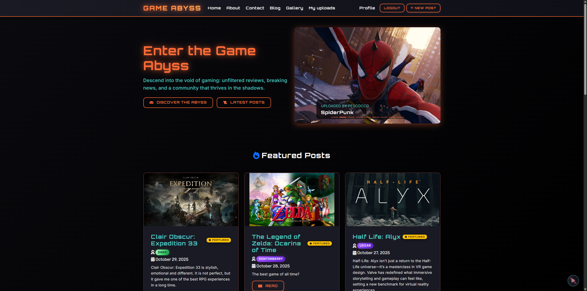

**About Page**

Information about Game Abyss, its mission, and the community-driven approach to gaming content.

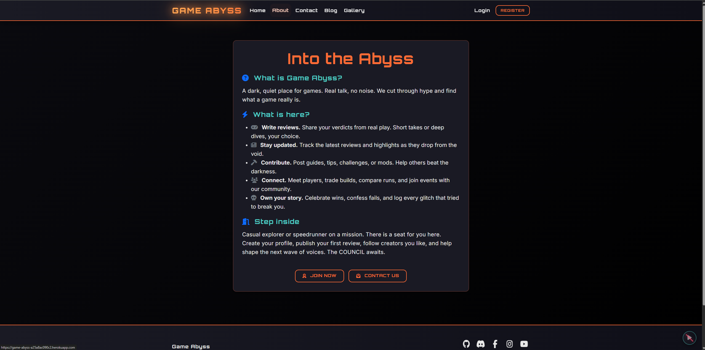

**Blog Page**

Browse all published blog posts with pagination, filtering by tags, and search functionality.

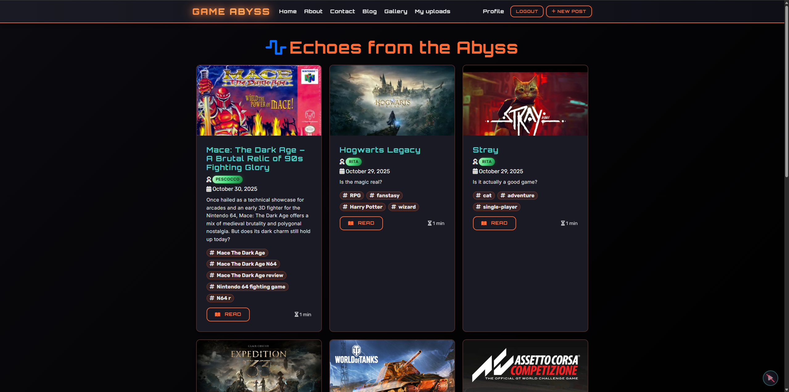

**Create New Post**

Rich text editor (Summernote) for creating and publishing blog posts with image uploads and tagging.

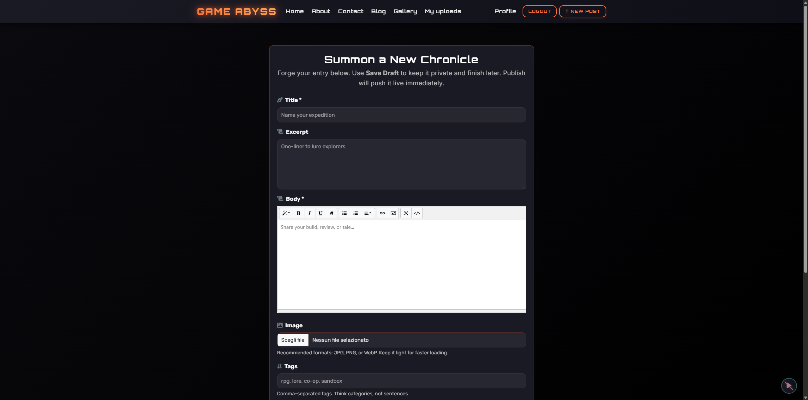

**User Profile**

Personalized profile pages showing user stats, avatar, favorite games, and published posts.

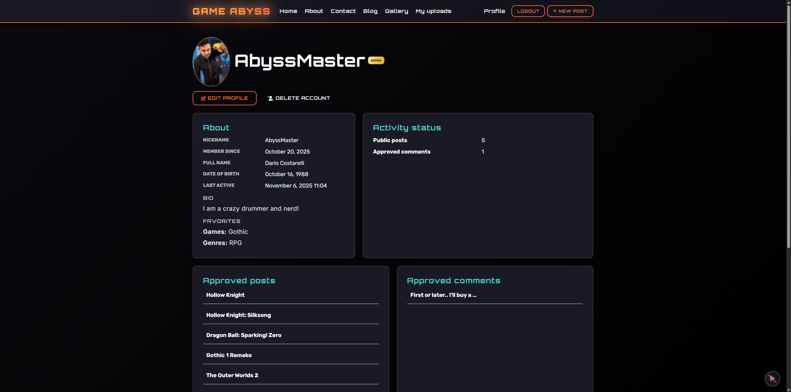

**Gallery**

Community gallery showcasing gaming screenshots and artwork uploaded by users.

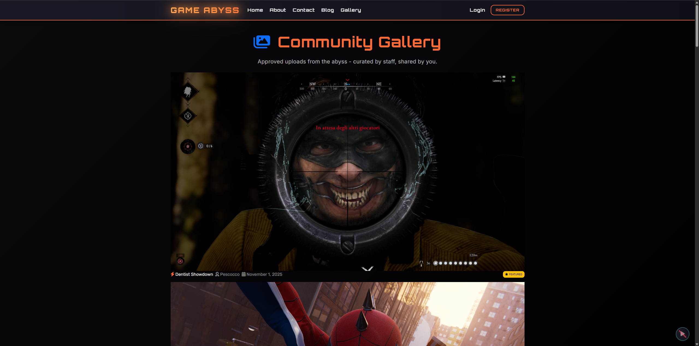

**Contact Page**

Contact form for users to reach out to the Game Abyss team with questions or feedback.

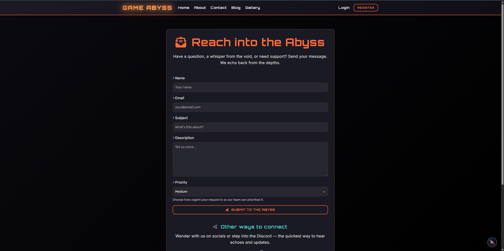

**Registration**

Sign up form for new users to create an account with email verification.

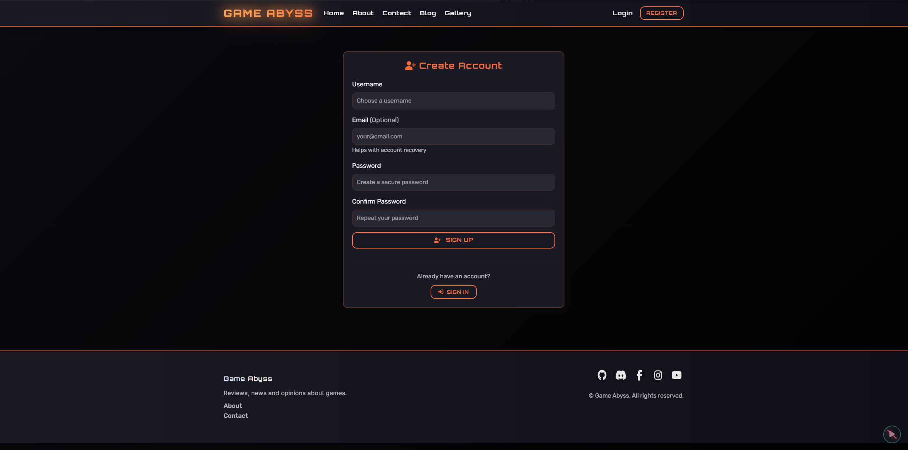

**Login**

Secure login page for existing users to access their accounts.

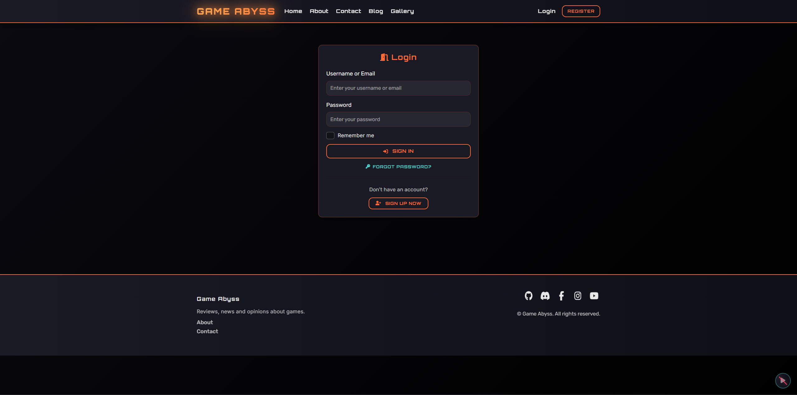

**Password Reset**

Email-based password recovery flow for users who forgot their credentials.

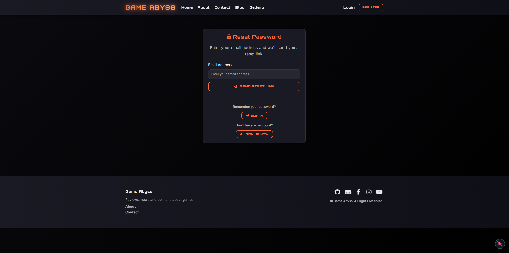

**Password Reset Confirmation**

Confirmation page after requesting a password reset link.

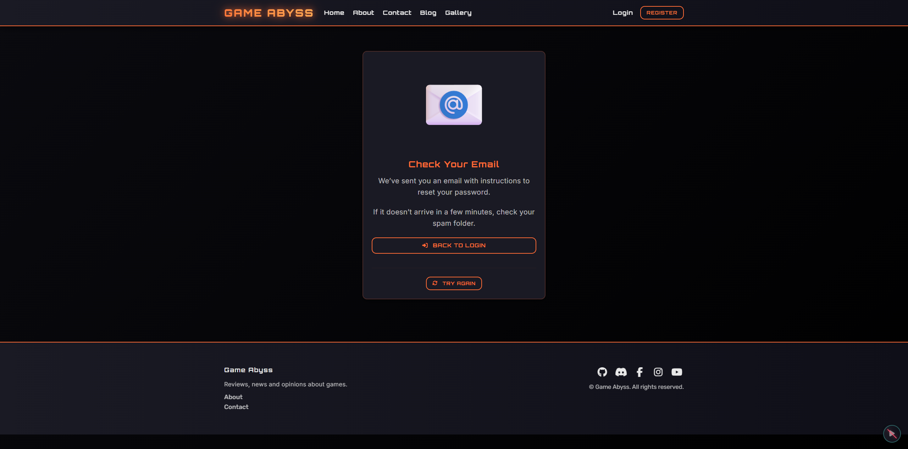

### Wireframes

I sketched out wireframes for the main pages before diving into code. This helped me visualize the layout and user flow early on. Key pages included:

- **Homepage** - Hero section with featured posts, latest posts grid, and call-to-action buttons
- **Blog Post List** - Card-based grid layout with pagination controls
- **Post Detail** - Full post content, author info, reactions, and comments thread
- **User Profile** - Avatar, bio, favorite games, and user's published posts
- **Gallery** - Masonry-style image grid with lightbox viewing
- **Create Post** - Form with Summernote rich text editor for formatting

The wireframes were simple sketches, but they gave me a clear roadmap for the template structure.

**Desktop Wireframes - Windows PC (27" Display, QHD 2560x1440)**

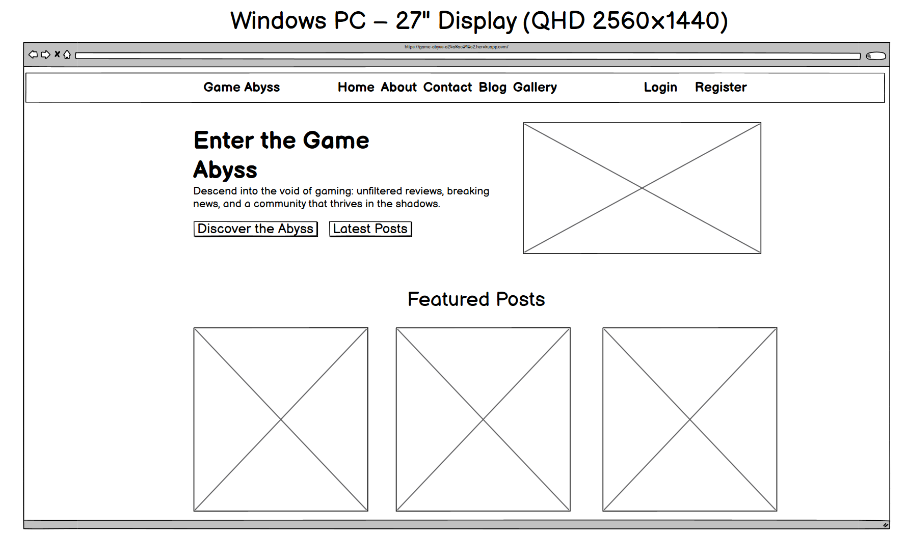

**Mobile Wireframes - Multiple Devices**

Testing across different screen sizes: iPhone 15 Pro (6.1"), iPad Pro 12.9", and Samsung Galaxy S24 (6.2")

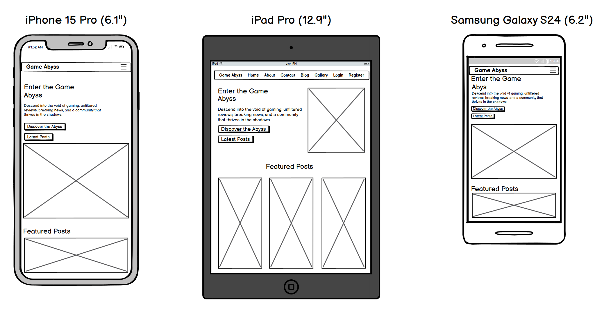

### Color Palette

I chose a **dark, gaming-inspired theme** that's easy on the eyes for long reading sessions:

| Color Name | Hex Code | Usage |
|------------|----------|-------|
| Dark Background | `#1a1a1a` | Main background, dark sections |
| Charcoal | `#2d2d2d` | Cards, containers, elevated elements |
| Accent Purple | `#8b5cf6` | Primary buttons, links, highlights |
| Accent Blue | `#3b82f6` | Secondary buttons, info elements |
| Success Green | `#10b981` | Success messages, positive actions |
| Warning Orange | `#f59e0b` | Warning alerts, pending status |
| Danger Red | `#ef4444` | Error messages, delete actions |
| Light Text | `#f9fafb` | Primary text on dark backgrounds |
| Gray Text | `#9ca3af` | Secondary text, muted information |

The color scheme creates a modern, professional look while being comfortable for gaming content consumption.

### Typography

I kept typography simple and readable:

- **Headers (H1-H6)** - System font stack (`-apple-system, BlinkMacSystemFont, "Segoe UI", Roboto, sans-serif`)
- **Body Text** - Same system font stack for consistency and performance
- **Code Blocks** - Monospace font family for technical content

Font weights vary between 400 (normal), 500 (medium), 600 (semibold), and 700 (bold) to create visual hierarchy without loading custom web fonts.

---

## Features

Game Abyss is packed with features built iteratively over the development process. Here's what makes it special:

### 1. Authentication System

- **User Registration** - Sign up with email, username, and password
- **Email Verification** - Confirm email address before full access (optional, configurable)
- **Login/Logout** - Secure session management with Django
- **Password Reset** - Email-based password recovery flow
- **Social Auth Ready** - Powered by django-allauth (can add Google/GitHub login later)
- **Remember Me** - Optional persistent login sessions

### 2. User Profiles

- **Custom Profile Model** - Extended User model with additional fields
- **Avatar Uploads** - Upload profile pictures (stored in Cloudinary)
- **Bio Section** - Write a personal bio about gaming interests
- **Favorite Games** - List up to 5 favorite games on profile
- **User's Posts** - Display all published blog posts by user
- **Public Profiles** - Anyone can view user profiles and their content
- **Edit Profile** - Update bio, avatar, and favorite games

### 3. Blog System (CRUD)

- **Create Posts** - Rich text editor (Summernote) with formatting options
- **Image Uploads** - Featured images for posts (Cloudinary integration)
- **Draft/Published Status** - Save drafts or publish immediately
- **Featured Posts** - Staff can mark posts as featured for homepage
- **Edit Posts** - Authors can edit their own posts
- **Delete Posts** - Authors can delete their own posts (with confirmation)
- **Slug Generation** - Automatic URL-friendly slugs from post titles
- **Tag System** - Categorize posts with tags for easier discovery
- **Post List View** - Paginated list of all published posts
- **Post Detail View** - Full post with reactions, comments, and author info
- **Author Attribution** - Each post clearly shows who wrote it

### 4. Comments and Reactions

- **Nested Comments** - Leave comments on blog posts
- **Edit Comments** - Edit your own comments
- **Delete Comments** - Remove your own comments
- **Post Reactions** - Like or dislike blog posts
- **Comment Reactions** - Like or dislike individual comments
- **Reaction Counts** - Display total likes and dislikes
- **One Reaction Per User** - Can't spam reactions (enforced at DB level)
- **Anonymous Viewing** - See reactions without being logged in

### 5. Gallery System

- **Image Uploads** - Share gaming screenshots and artwork
- **Gallery Grid** - Masonry-style layout of all images
- **Lightbox View** - Click to view full-size images
- **Image Captions** - Add descriptions to uploaded images
- **Pagination** - Handle large numbers of images efficiently

### 6. Moderation System

- **Report Posts** - Users can flag inappropriate blog posts
- **Report Comments** - Flag problematic comments for review
- **Staff Dashboard** - Moderators see pending reports in admin
- **Approve/Reject** - Staff can approve or reject reported content
- **Moderation Logs** - Track all moderation actions with reasons
- **Auto-Hide** - Heavily reported content hidden until reviewed
- **Email Notifications** - Staff receive emails about new reports

### 7. Email System

- **Welcome Emails** - New users receive welcome message after signup
- **Password Reset Emails** - Secure reset link sent via email
- **Moderation Alerts** - Staff notified about content reports
- **HTML Email Templates** - Branded, styled email templates
- **Inline CSS** - Premailer package for email client compatibility
- **SendGrid Integration** - Reliable email delivery in production

### 8. Design and UX

- **Responsive Design** - Works perfectly on mobile, tablet, and desktop
- **Bootstrap 5** - Modern, mobile-first CSS framework
- **Dark Theme** - Gaming-friendly dark color scheme
- **Toast Notifications** - Success/error messages with auto-dismiss
- **Form Validation** - Client and server-side validation for all forms
- **Loading States** - Clear feedback during async operations
- **Error Pages** - Custom 404, 403, and 500 error pages

### 9. Security Features

- **CSRF Protection** - Django's built-in CSRF tokens on all forms
- **SQL Injection Prevention** - Django ORM handles query escaping
- **XSS Protection** - Template auto-escaping prevents XSS attacks
- **Password Hashing** - Secure password storage with Django's hashers
- **Login Required** - Decorators protect sensitive views
- **Ownership Checks** - Users can only edit/delete their own content
- **Staff Permissions** - Moderation features restricted to staff users

### 10. Performance and Optimization

- **Database Indexing** - Optimized queries with proper indexes
- **Pagination** - Limit items per page to reduce load times
- **Static File Compression** - Whitenoise serves compressed static files
- **CDN Integration** - Cloudinary CDN for fast media delivery
- **Lazy Loading** - Images load as you scroll (native lazy loading)
- **Query Optimization** - Use of `select_related` and `prefetch_related`

---


## Database Design

Game Abyss uses **PostgreSQL in production** (Heroku) and **SQLite for local development**. The database schema is designed to support all features efficiently.

### Entity Relationship Overview

The database consists of **8 main models** spread across different apps:

1. **User** (Django built-in) - Authentication and basic user info
2. **UserProfile** (accounts app) - Extended user information
3. **BlogPost** (blog app) - Blog articles with status and metadata
4. **Comment** (blog app) - User comments on blog posts
5. **PostReaction** (blog app) - Likes/dislikes on posts
6. **CommentReaction** (blog app) - Likes/dislikes on comments
7. **CommentReport** (blog app) - User reports for moderation
8. **GalleryImage** (gallery app) - Uploaded gaming images

### Key Relationships

- **User to UserProfile**: One-to-One (each user has exactly one profile)
- **User to BlogPost**: One-to-Many (users can write multiple posts)
- **BlogPost to Comment**: One-to-Many (posts can have multiple comments)
- **User to Comment**: One-to-Many (users can leave multiple comments)
- **User to PostReaction**: One-to-Many (users can react to multiple posts)
- **BlogPost to PostReaction**: One-to-Many (posts can have multiple reactions)
- **User to CommentReaction**: One-to-Many (users can react to multiple comments)
- **Comment to CommentReaction**: One-to-Many (comments can have multiple reactions)
- **Comment to CommentReport**: One-to-Many (comments can be reported multiple times)
- **User to GalleryImage**: One-to-Many (users can upload multiple images)

### Model Schemas

**UserProfile Model** (`accounts/models.py`)
```
- user (OneToOneField to User)
- bio (TextField, optional)
- avatar (CloudinaryField, optional)
- favorite_game_1 through favorite_game_5 (CharField, optional)
- created_at (DateTimeField, auto)
- updated_at (DateTimeField, auto)
```

**BlogPost Model** (`blog/models.py`)
```
- title (CharField, max 200)
- slug (SlugField, unique)
- author (ForeignKey to User)
- content (TextField, rich text via Summernote)
- excerpt (TextField, optional)
- image (CloudinaryField, optional)
- status (CharField: draft/published)
- featured (BooleanField, default False)
- tags (CharField, optional)
- created_at (DateTimeField, auto)
- updated_at (DateTimeField, auto)
- published_at (DateTimeField, nullable)
```

**Comment Model** (`blog/models.py`)
```
- post (ForeignKey to BlogPost)
- author (ForeignKey to User)
- body (TextField)
- created_at (DateTimeField, auto)
- updated_at (DateTimeField, auto)
- is_edited (BooleanField, default False)
```

**PostReaction Model** (`blog/models.py`)
```
- user (ForeignKey to User)
- post (ForeignKey to BlogPost)
- reaction_type (CharField: like/dislike)
- created_at (DateTimeField, auto)
- Unique constraint: (user, post)
```

**CommentReaction Model** (`blog/models.py`)
```
- user (ForeignKey to User)
- comment (ForeignKey to Comment)
- reaction_type (CharField: like/dislike)
- created_at (DateTimeField, auto)
- Unique constraint: (user, comment)
```

**CommentReport Model** (`blog/models.py`)
```
- comment (ForeignKey to Comment)
- reporter (ForeignKey to User)
- reason (TextField)
- status (CharField: pending/reviewed/dismissed)
- reviewed_by (ForeignKey to User, nullable)
- reviewed_at (DateTimeField, nullable)
- created_at (DateTimeField, auto)
```

**GalleryImage Model** (`gallery/models.py`)
```
- title (CharField, max 200)
- image (CloudinaryField)
- caption (TextField, optional)
- uploaded_by (ForeignKey to User)
- created_at (DateTimeField, auto)
```

---

## Technologies Used

### Core Web Technologies

- **HTML5** - Semantic markup for content structure
- **CSS3** - Custom styling with modern features (Grid, Flexbox, CSS Variables)
- **JavaScript (ES6+)** - Interactive features and dynamic content
- **Bootstrap 5.3** - Responsive CSS framework for layout and components

### Backend and Database

- **Python 3.11** - Primary programming language
- **Django 5.2.7** - High-level Python web framework
- **PostgreSQL** - Production database (Heroku Postgres addon)
- **SQLite** - Local development database
- **Gunicorn** - Python WSGI HTTP server for production

### Django Packages and Extensions

| Package | Version | Purpose |
|---------|---------|---------|
| `django-allauth` | 65.3.0 | Authentication (signup, login, social auth ready) |
| `django-summernote` | 0.8.20.0 | WYSIWYG rich text editor for blog posts |
| `django-crispy-forms` | 2.3 | Better form rendering with Bootstrap |
| `crispy-bootstrap5` | 2024.10 | Bootstrap 5 template pack for crispy forms |
| `django-jazzmin` | 3.0.1 | Modern, colorful admin dashboard styling |
| `django-cloudinary-storage` | 0.3.0 | Cloudinary integration for media storage |
| `whitenoise` | 6.8.2 | Simplified static file serving for Django |

### Email and Communication

- **SendGrid** - Email delivery service (production)
- **premailer** - Inline CSS in HTML emails for compatibility
- **dj-database-url** - Parse database URLs from environment variables

### Development Tools

| Tool | Version | Purpose |
|------|---------|---------|
| `pylint` | 3.3.5 | Python code linting and quality checks |
| `pylint-django` | 2.6.1 | Django-specific Pylint plugin |
| `flake8` | 7.1.1 | Python style guide enforcement (PEP 8) |
| `djlint` | 1.36.4 | Django/Jinja template linter and formatter |
| `black` | 24.10.0 | Opinionated Python code formatter |

### Deployment and Hosting

- **Heroku** - Cloud platform for app deployment
- **Cloudinary** - CDN for image and media storage
- **Git** - Version control
- **GitHub** - Code repository hosting

### Design and Media Tools

- **Balsamiq** - Wireframing tool for initial layouts
- **Coolors** - Color palette generator
- **Font Awesome** - Icon library
- **Google Fonts** - Web typography (system fonts used for performance)

---

## Testing and Bug Fixes

Testing was a **huge focus** throughout development. I wanted to make sure every feature worked correctly and handled edge cases gracefully.

**For detailed testing documentation, see [TESTING.md](TESTING.md)**

### Testing Highlights

✅ **76 automated tests** written covering models, views, forms, and utilities
✅ **10/10 Pylint score** on all Python files (pylint-django used)
✅ **PEP 8 compliant** code verified with Flake8
✅ **HTML validation** passed for all templates (W3C Validator)
✅ **CSS validation** passed for style.css and email.css
✅ **Manual testing** performed on all user flows and edge cases
✅ **Responsive testing** on mobile, tablet, and desktop devices
✅ **Browser compatibility** tested on Chrome, Firefox, Safari, and Edge
✅ **Real user testing** feedback incorporated from beta testers

The testing documentation includes test coverage breakdowns, bug reports with fixes, validation screenshots, and user testing feedback.

---

## Behind the Scenes: My Development Journey

Building Game Abyss was an **iterative process**. I didn't build everything at once. Instead, I tackled features one at a time, committed changes frequently, and learned from mistakes along the way.

### The Iterative Philosophy

I followed a simple approach:

1. **Plan a feature** - Write down what I need and why
2. **Build the MVP** - Get the core functionality working first
3. **Test thoroughly** - Write tests and manually verify everything works
4. **Refine and polish** - Improve UX, add validation, handle edge cases
5. **Commit and move on** - Git commit, then start the next feature

This kept me from getting overwhelmed and ensured each piece was solid before moving forward.

### Challenges I Faced (and Solved)

**Challenge 1: Email CSS Not Rendering in Gmail**

Gmail strips `<style>` tags from emails, breaking the formatting of my notification emails.

**Solution**: I discovered the `premailer` package, which automatically converts CSS in `<style>` tags to inline `style` attributes. Problem solved! Now emails look perfect in all email clients.

**Challenge 2: Duplicate Reactions from Double-Clicking**

Users could double-click the "like" button and create duplicate reactions, breaking the "one reaction per user" rule.

**Solution**: I added a **unique constraint** at the database level (`unique_together` on the PostReaction and CommentReaction models). Now Django raises an error if a duplicate is attempted, and I handle it gracefully in the view.

**Challenge 3: Summernote Editor Security**

The rich text editor allowed users to paste ANY HTML, including `<script>` tags, which is a massive security risk (XSS attacks).

**Solution**: I configured Summernote to **strip dangerous tags** and only allow safe formatting tags like `<p>`, `<strong>`, `<em>`, `<ul>`, etc. I also use Django's `|safe` filter carefully in templates.

**Challenge 4: Heroku Slug Size Too Large**

My initial Heroku deployment failed because the slug size exceeded 500MB. I had installed all development dependencies in production!

**Solution**: I split `requirements.txt` (production only) from `dev-requirements.txt` (development tools). This reduced the slug size significantly and deployment succeeded.

### Continuous Learning

Every challenge taught me something new. I learned about:

- Email client compatibility and inline CSS
- Database constraints and integrity
- XSS prevention and sanitization
- Heroku deployment optimization
- Django signals for automated tasks
- Testing strategies (unit, integration, manual)

Building Game Abyss wasn't just about writing code. It was about **problem-solving, researching, and growing as a developer**.

---


## Future Improvements

While I'm proud of what Game Abyss has become, there are several features I'd love to add in the future. Here's what's on the roadmap:

### 1. Profile Image Cropping

**What**: Allow users to crop and position their avatar when uploading, instead of relying on automatic cropping.

**Why It Would Be Cool**: Right now, when users upload a profile picture, it might not be centered the way they want. A crop tool (like a draggable box) would let users choose exactly how their avatar looks.

**How I'd Build It**: Use a JavaScript library like **Cropper.js** on the frontend to let users adjust the crop area. Send the crop coordinates to the backend, and use **Pillow** (Python imaging library) to process and save the cropped version.

### 2. Staff Bar with Pending Notifications

**What**: A notification bar for staff users showing the number of pending reports, new posts awaiting approval, and other moderation tasks.

**Why It Would Be Cool**: Right now, staff have to go into the admin panel to check if there's anything to moderate. A visible notification bar on the main site would make moderation much more efficient and proactive.

**How I'd Build It**: Add a context processor that counts pending reports and unapproved content. Display it in the navbar for staff users with badge indicators (like "3 reports pending"). Clicking it takes them directly to the moderation dashboard.

### 3. Search Functionality

**What**: A search bar to find blog posts by title, content, author, or tags.

**Why It Would Be Cool**: As the blog grows, users need a way to find specific topics or posts without scrolling through pages of content.

**How I'd Build It**: Use Django's `Q` objects for basic search queries (`title__icontains`, `content__icontains`, `tags__icontains`). For more advanced search, integrate **PostgreSQL full-text search** or a service like **Algolia**.

### 4. Gamification (Badges and Achievements)

**What**: Award badges to users for milestones like "First Post", "10 Comments", "100 Likes Received", etc.

**Why It Would Be Cool**: Gamification encourages engagement and makes the community more fun. People love collecting achievements!

**How I'd Build It**: Create a `Badge` model and a `UserBadge` model (many-to-many relationship). Use **Django signals** to automatically award badges when users hit milestones. Display badges on user profiles.

### 5. In-App Notifications

**What**: A notification system where users get alerts for comments on their posts, reactions, or replies.

**Why It Would Be Cool**: Right now, users have to manually check their posts to see if anyone commented. Notifications would keep them engaged and bring them back to the site.

**How I'd Build It**: Create a `Notification` model linked to users. Use Django signals to create notifications when someone comments on a user's post. Display a notification icon in the navbar with unread count.

### 6. Following System

**What**: Let users follow each other to see their latest posts in a personalized feed.

**Why It Would Be Cool**: This adds a social networking aspect to Game Abyss, making it more community-driven.

**How I'd Build It**: Create a `Follow` model (many-to-many self-referencing relationship). Add "Follow" buttons on user profiles. Create a "Following Feed" view that shows posts only from users you follow.

### 7. Game Database Integration

**What**: Connect to a gaming API (like IGDB or RAWG) to let users search for games and add them to their profile with official data.

**Why It Would Be Cool**: Instead of manually typing "Favorite Game 1", users could search a database of thousands of games and select them, with official cover art and metadata.

**How I'd Build It**: Use the **RAWG API** (free tier available) to fetch game data. Add an autocomplete search field on the profile edit page. Store the game ID and fetch details dynamically.

### 8. Rich Media Embeds

**What**: Allow users to embed YouTube videos, Twitch clips, and Spotify playlists directly in blog posts.

**Why It Would Be Cool**: Gaming content is visual and audio-rich. Embedding videos and music would make posts way more engaging.

**How I'd Build It**: Use **oEmbed** services or a library like **Django-embed-video** to convert URLs into embedded players. Add custom Summernote buttons for quick embedding.

---

### Why Not Now?

You might wonder: "Why didn't you build all these features?"

The honest answer: **scope management**. For a student project with a deadline, I had to prioritize the **core features** that demonstrate my skills:

- Full CRUD functionality ✅
- User authentication and profiles ✅
- Robust moderation system ✅
- Email notifications ✅
- Responsive design ✅
- Comprehensive testing ✅

The features above are **enhancements** that would take this from a great project to a commercial-level platform. But they're not essential to prove I can build a full-stack Django application.

I'm confident I could implement them (and I've outlined exactly how), but I chose to focus on **polishing what I have** rather than rushing to add half-finished features.

Quality over quantity, always.

---

## Deployment

### Live Site

The live version of Game Abyss is deployed on Heroku:

**Live Link**: [https://game-abyss-14c5bc3a39ec.herokuapp.com/](https://game-abyss-14c5bc3a39ec.herokuapp.com/)

---

### Local Development Setup

Want to run Game Abyss on your local machine? Follow these steps:

**Prerequisites**: Python 3.11+, Git, PostgreSQL (optional, SQLite works too)

**1. Clone the Repository**

```bash
git clone https://github.com/Drake-Designer/Game-Abyss.git
cd Game-Abyss
```

**2. Create a Virtual Environment**

```bash
python -m venv venv
```

**3. Activate the Virtual Environment**

- **Windows**: `venv\Scripts\activate`
- **macOS/Linux**: `source venv/bin/activate`

**4. Install Dependencies**

```bash
pip install -r requirements.txt
pip install -r dev-requirements.txt
```

(The second line installs development tools like Pylint, Flake8, and djlint)

**5. Create `env.py` File**

In the root directory, create a file called `env.py` with the following content:

```python
import os

os.environ.setdefault("SECRET_KEY", "your-secret-key-here")
os.environ.setdefault("DEBUG", "True")
os.environ.setdefault("DATABASE_URL", "sqlite:///db.sqlite3")

# Cloudinary (optional for local, use placeholder images if skipped)
os.environ.setdefault("CLOUDINARY_URL", "cloudinary://your-cloudinary-url")

# Email (optional for local, emails will print to console if skipped)
os.environ.setdefault("SENDGRID_API_KEY", "your-sendgrid-api-key")
os.environ.setdefault("DEFAULT_FROM_EMAIL", "noreply@gameabyss.com")
```

**6. Run Migrations**

```bash
python manage.py migrate
```

**7. Create a Superuser**

```bash
python manage.py createsuperuser
```

Follow the prompts to set username, email, and password.

**8. Collect Static Files**

```bash
python manage.py collectstatic --noinput
```

**9. Run the Development Server**

```bash
python manage.py runserver
```

Open your browser and go to `http://127.0.0.1:8000/`

---

### Heroku Deployment

Here's how I deployed Game Abyss to Heroku:

**1. Create a Heroku Account**

Sign up at [heroku.com](https://www.heroku.com/) if you don't have an account.

**2. Install Heroku CLI**

Download and install the [Heroku CLI](https://devcenter.heroku.com/articles/heroku-cli).

**3. Login to Heroku**

```bash
heroku login
```

**4. Create a New Heroku App**

```bash
heroku create game-abyss
```

(Choose your own unique app name)

**5. Add PostgreSQL Database**

```bash
heroku addons:create heroku-postgresql:mini
```

**6. Set Environment Variables**

```bash
heroku config:set SECRET_KEY="your-secret-key-here"
heroku config:set DEBUG="False"
heroku config:set CLOUDINARY_URL="cloudinary://your-cloudinary-url"
heroku config:set SENDGRID_API_KEY="your-sendgrid-api-key"
heroku config:set DEFAULT_FROM_EMAIL="noreply@gameabyss.com"
heroku config:set DISABLE_COLLECTSTATIC=1
```

**7. Push to Heroku**

```bash
git push heroku main
```

**8. Run Migrations on Heroku**

```bash
heroku run python manage.py migrate
```

**9. Create a Superuser on Heroku**

```bash
heroku run python manage.py createsuperuser
```

**10. Open Your Live Site**

```bash
heroku open
```

Your app should now be live on Heroku!

---

## Credits

Building Game Abyss was a learning journey, and I relied on countless resources, communities, and tools along the way. Here's a big thank you to everyone and everything that helped:

### Documentation and Learning Resources

- **Django Documentation** - My go-to reference for everything Django: [docs.djangoproject.com](https://docs.djangoproject.com/)
- **Bootstrap Documentation** - For responsive layout and components: [getbootstrap.com/docs](https://getbootstrap.com/docs/)
- **django-allauth Docs** - Saved me hours on authentication: [django-allauth.readthedocs.io](https://django-allauth.readthedocs.io/)
- **Cloudinary Django Integration** - Media storage made easy: [cloudinary.com/documentation/django_integration](https://cloudinary.com/documentation/django_integration)

### Communities and Support

- **Stack Overflow** - Answered so many of my "why isn't this working?" questions
- **Django Forum** - Helpful discussions on best practices and troubleshooting
- **Code Institute Slack Community** - Fellow students and mentors who provided feedback and support
- **Reddit (r/django)** - Great for learning from other developers' experiences

### Tools and Services

- **Heroku** - Simple, powerful deployment platform
- **Cloudinary** - Reliable CDN for image hosting
- **SendGrid** - Email delivery service that just works
- **GitHub** - Version control and code hosting
- **VS Code** - My code editor of choice with amazing Django extensions

### Design Inspiration

- **Coolors.co** - For generating the color palette
- **Font Awesome** - Icon library for UI elements
- **Unsplash** - Placeholder images during development

### Tutorials and Guides

- **Corey Schafer's Django Tutorials** - YouTube series that helped me understand Django fundamentals
- **Real Python** - In-depth articles on Django, testing, and deployment
- **MDN Web Docs** - Reference for HTML, CSS, and JavaScript

### Media and Assets

- User-uploaded images in the gallery are the property of their respective uploaders
- Gaming-related content and imagery used for educational purposes only

### Testing and Validation Tools

- **W3C Markup Validator** - HTML validation
- **W3C CSS Validator** - CSS validation
- **JSHint** - JavaScript code quality
- **Pylint** - Python code quality
- **Lighthouse** - Performance and accessibility audits

### Special Thanks

- **Lewis Dillon** ([GitHub](https://github.com/LewisMDillon) | [LinkedIn](https://www.linkedin.com/in/lewis-dillon/)) - My mentor who reviewed the site, helped with content, provided valuable feedback, and served as a staff member to test moderation features. Thank you for pushing me to improve!

- **Andrea Contarino** ([GitHub](https://github.com/andconta) | [LinkedIn](https://www.linkedin.com/in/andreacontarino/)) - Senior Software Engineer who provided invaluable advice on code implementation, site structure, and best practices. Also tested the site as a staff member. Your expertise made a huge difference!

- **Giuseppe Strano** ([GitHub](https://github.com/zupeppe)) - Beta tester who thoroughly tested the site from a user perspective, posted game reviews, and provided great feedback on the user experience.

- **Luca Di Blasi** ([LinkedIn](https://www.linkedin.com/in/luca-di-blasi-b21544a3/)) - Beta tester who tested the site as a user, uploaded photos to the gallery, and posted game reviews, helping me test multiple features.

- **Rita Perrone** ([LinkedIn](https://www.linkedin.com/in/rita-perrone-9aa7aaa2/)) - Beta tester who tested the site from a user perspective, contributed photos to the gallery, and posted game reviews, providing valuable real-world testing data.

- **Giuseppe Aguglia** ([LinkedIn](https://www.linkedin.com/in/giuseppe-aguglia/)) - Beta tester who tested the site as a user and posted game reviews, helping verify the complete user workflow.

---

<div align="center">

**Thank you for checking out Game Abyss!**
If you have any questions or feedback, feel free to reach out. Happy gaming! 🎮

Made with ❤️ by [Drake-Designer](https://github.com/Drake-Designer)

</div>

