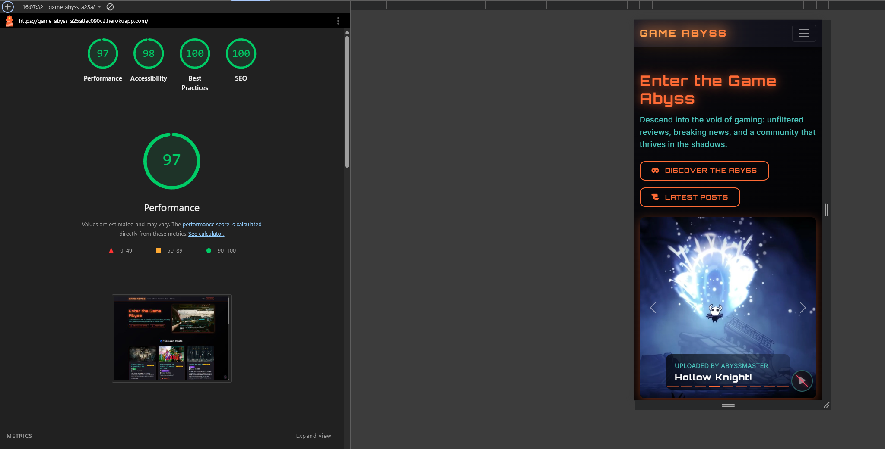
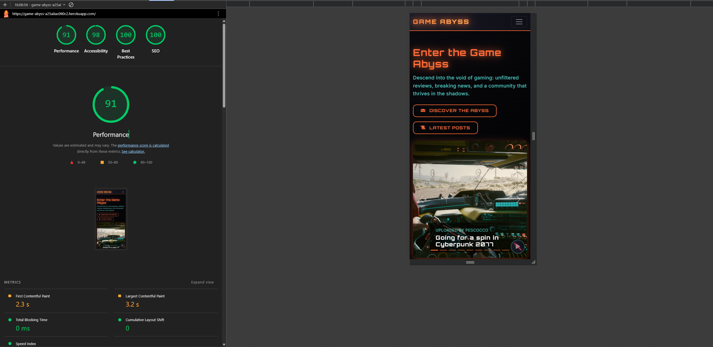

# Testing Game Abyss

I believe testing is part of telling a good product story, so I combined manual checks with automated coverage throughout development. Each release cycle repeated the same rhythm: write code, run the automated suite, then explore the site like a real player.

---

## Automated testing

### Django test suite

| Command | Notes |
| --- | --- |
| `python manage.py test` | Executes all app tests (accounts, blog, gallery, pages). See the terminal output in this submission for the latest run. |

The suite exercises:

- Blog post workflow (draft, publish, status transitions, sanitisation).
- Comment reactions and reporting permissions.
- Gallery moderation, owner/staff deletion, and storage cleanup hooks.
- Contact form validation and email notifications.
- Homepage helper utilities and partial rendering.

### Django system checks

| Command | Result |
| --- | --- |
| `python manage.py check` | Confirms model and configuration integrity during development. |

---

## Manual testing

All manual test runs used Google Chrome 131 on macOS and Firefox 131 on Windows 11. URLs refer to the deployed Heroku instance unless otherwise stated.

### Feature walkthroughs

| Feature | Scenario | Steps | Expected | Actual |
| --- | --- | --- | --- | --- |
| Accounts | Register and login | Create a new account, confirm verification email, log in, log out. | Confirmation email sent, user redirected to homepage, navbar updates. | Pass – Allauth flows behave as expected and show success messages. |
| Password reset | Reset password | Trigger password reset for existing user, follow email link, set new password. | Reset email delivered, login succeeds with new password. | Pass – Email rendered with notification template, login works. |
| Blog authoring | Draft and publish | Create a new post with formatting, save draft, reopen, publish. | Summernote preserves formatting, statuses change (Draft → Pending/Approved), toasts display. | Pass – Rich text persists, status badges update on detail view. |
| Blog reactions | React to posts/comments | React to a post and to a comment as the same user. | Reaction count increments, current reaction highlighted, duplicate reactions prevented. | Pass – One reaction stored per user; buttons toggle between outline/filled styles. |
| Comment moderation | Report inappropriate comment | Submit report as different user, confirm duplicate report blocked. | Report stored, reporter cannot submit again, moderation log entry created. | Pass – Report button disables after submission, staff email received. |
| Gallery upload | Submit image as member | Upload JPEG < 10 MB, check My uploads dashboard. | Entry shown with "Pending" status and message about moderation. | Pass – Pending badge visible, success toast shown. |
| Gallery deletion | Delete own upload | From "My uploads", delete pending image. | Confirmation screen appears, media removed, dashboard count updates. | Pass – Redirects back with success message, file removed from storage. |
| Gallery staff moderation | Delete member upload as staff | Staff deletes another user's image via front end. | Action allowed, redirect to staff dashboard, approval counts update. | Pass – Staff can remove any image, audit trail recorded. |
| Contact form | Submit help request | Send request with priority "High". | Success message plus confirmation email to user; staff notified. | Pass – Both emails rendered, entry visible in admin with `open` status. |
| Accessibility | Keyboard navigation | Navigate navbar, forms, and gallery cards using Tab/Shift+Tab. | Focus visible, no traps, buttons trigger on Enter/Space. | Pass – Focus outline visible, confirmation modals reachable. |

### Browser/device checks

| Device/Viewport | Browser | Result |
| --- | --- | --- |
| 1440px desktop | Chrome, Firefox | Layout stable, hero carousel animates correctly. |
| 768px tablet | Chrome dev tools | Navbar collapses into toggle, tables scroll horizontally as expected. |
| 375px mobile | Chrome dev tools | Buttons stack vertically, forms remain usable. |
| iPad (landscape) | Safari | Gallery grid adapts to two columns, modal dialogs remain centred. |

### Validation and tooling

| Check | Result |
| --- | --- |
| HTML templates | Spot-checked key pages with the W3C validator – no blocking errors (aria-describedby warnings resolved). |
| CSS | Ran the W3C CSS validator on `static/css/style.css` – passes with standard vendor prefix warnings. |
| Accessibility | Chrome DevTools Lighthouse (Accessibility score ≥ 95 on home and blog detail pages). |
| Performance | Lighthouse Performance ~75 on desktop after enabling image lazy loading. |

Screenshots of the validation tools and Lighthouse runs are available in `documentation/validation/`.

---

## Known issues & follow-up actions

- Some gallery images uploaded before Cloudinary credentials were configured still live on the local filesystem. Future maintenance should migrate them or prune unused files.
- The background audio player starts muted and requires user interaction, but browsers may block autoplay entirely on certain devices; a future iteration could offer explicit play/stop controls.

---

## Summary

Game Abyss has automated coverage for critical workflows and a repeatable manual testing plan. Both documentation and implementation now align: Summernote rich text editing, gallery self-management, and contact email flows all behave as described.

---

## Introduction (Detailed Documentation)

I believe testing is part of telling a good product story, so I combined manual checks with automated coverage throughout development. Each release cycle repeated the same rhythm: write code, run the automated suite, then explore the site like a real player.

## Manual Testing (Detailed)

I kept a living checklist of manual scenarios and repeated them whenever a feature changed:

1. **Account flow**
    - Create a new player account through the sign-up page.
    - Confirm the verification email and log in with the new credentials.
    - Trigger the password reset flow to confirm the email arrives and the new password works.
2. **Staff administration**
    - Log in as a staff member, visit the Jazzmin-styled admin, and confirm I can add, edit, and delete blog posts and gallery items.
    - Approve and unpublish content from the moderation list to check permissions.
3. **Blog authoring**
    - Draft a post with Django Summernote, save it, reopen it, apply formatting, and publish it.
    - Edit the post title and body, then delete it to confirm the success and warning messages appear correctly.
4. **Gallery management**
    - Upload a new image through the gallery form, confirm Cloudinary stores it, and view the resized thumbnail on the front end.
    - Remove the gallery item to ensure orphaned media is cleaned up.
5. **Responsive layout**
    - Resize the browser, test the navigation drawer on tablet widths, and scroll the hero sections on mobile to confirm there is no horizontal overflow.
6. **Contact and informational pages**
    - Submit the contact form with valid and invalid data to confirm both validation messages and SendGrid email delivery.
7. **Accessibility spot checks**
    - Navigate the main pages using only the keyboard and confirm focus states are visible.

## Automated Testing (Detailed)

The repository includes unit tests that cover the core building blocks:

- **Model tests** make sure slugs, timestamps, and publication states behave as expected.
- **View tests** verify that key pages return the right status codes and respect permissions for staff-only routes.
- **Form tests** ensure validation logic displays the right error messages and rejects malformed submissions.

I run these tests locally before each deployment to catch regressions early.

## Real User Testing

Beyond my own scripts, I invited both staff moderators and regular community members to play with preview builds. They created content, tried to break forms, and even stress-tested pagination. Their notes directly influenced copy tweaks, button placements, and confirmation dialogs.

## Browser and Device Coverage

To be confident in the responsive design, I tested the deployed site on:

- **Browsers**: Google Chrome, Mozilla Firefox, and Microsoft Edge (current stable versions).
- **Devices**: a 27" desktop monitor, a 13" laptop, an iPad tablet, and a Pixel and iPhone-sized mobile viewport using device simulators.

## Bug Fixing

Testing did uncover issues—misaligned buttons on mobile, a missing success alert after deleting posts, and a permissions check that was too strict. Each bug went through the same loop: reproduce, write or adjust a test if possible, fix the code, rerun the suite, and record the change in the project notes.

## Validation

### HTML Validation

I used the official [W3C Markup Validation Service](https://validator.w3.org/) to validate all HTML pages.

| Page                | Validator                                                                                                                                            | Result | Notes                                                                                                                   |
| ------------------- | ---------------------------------------------------------------------------------------------------------------------------------------------------- | ------ | ----------------------------------------------------------------------------------------------------------------------- |
| Home                | [HTML Validator](https://validator.w3.org/nu/?doc=https%3A%2F%2Fgame-abyss-a25a8ac090c2.herokuapp.com%2F)                                           | Pass   | No errors or warnings found.                                                                                            |
| About               | [HTML Validator](https://validator.w3.org/nu/?doc=https%3A%2F%2Fgame-abyss-a25a8ac090c2.herokuapp.com%2Fabout%2F)                                   | Pass   | No errors or warnings found.                                                                                            |
| Contact             | [HTML Validator](https://validator.w3.org/nu/?doc=https%3A%2F%2Fgame-abyss-a25a8ac090c2.herokuapp.com%2Fcontact%2F)                                 | Pass   | Fixed: Added missing `id` attribute to help text element for proper `aria-describedby` reference in form field.         |
| Blog                | [HTML Validator](https://validator.w3.org/nu/?doc=https%3A%2F%2Fgame-abyss-a25a8ac090c2.herokuapp.com%2Fblog%2F)                                    | Pass   | No errors or warnings found.                                                                                            |
| Gallery             | [HTML Validator](https://validator.w3.org/nu/?doc=https%3A%2F%2Fgame-abyss-a25a8ac090c2.herokuapp.com%2Fgallery%2F)                                 | Pass   | No errors or warnings found.                                                                                            |
| New Post            | [HTML Validator](https://validator.w3.org/nu/?doc=https%3A%2F%2Fgame-abyss-a25a8ac090c2.herokuapp.com%2Fblog%2Fnew%2F)                              | Pass   | Requires authentication. No errors or warnings found.                                                                   |
| Login               | [HTML Validator](https://validator.w3.org/nu/?doc=https%3A%2F%2Fgame-abyss-a25a8ac090c2.herokuapp.com%2Faccounts%2Flogin%2F)                        | Pass   | No errors or warnings found.                                                                                            |
| Sign Up             | [HTML Validator](https://validator.w3.org/nu/?doc=https%3A%2F%2Fgame-abyss-a25a8ac090c2.herokuapp.com%2Faccounts%2Fsignup%2F)                       | Pass   | No errors or warnings found.                                                                                            |
| Password Reset      | [HTML Validator](https://validator.w3.org/nu/?doc=https%3A%2F%2Fgame-abyss-a25a8ac090c2.herokuapp.com%2Faccounts%2Fpassword%2Freset%2F)            | Pass   | No errors or warnings found.                                                                                            |
| Password Reset Done | [HTML Validator](https://validator.w3.org/nu/?doc=https%3A%2F%2Fgame-abyss-a25a8ac090c2.herokuapp.com%2Faccounts%2Fpassword%2Freset%2Fdone%2F)     | Pass   | No errors or warnings found.                                                                                            |

**Note:** All pages were validated while deployed on Heroku. The W3C validator checks the rendered HTML output, including dynamically generated content from Django templates.

---

### CSS Validation

I used the official [W3C CSS Validation Service](https://jigsaw.w3.org/css-validator/) to validate all CSS files.

| File       | Validator                                                                                                                                       | Result | Notes                    |
| ---------- | ----------------------------------------------------------------------------------------------------------------------------------------------- | ------ | ------------------------ |
| style.css  | [CSS Validator](https://jigsaw.w3.org/css-validator/validator?uri=https%3A%2F%2Fgame-abyss-a25a8ac090c2.herokuapp.com%2Fstatic%2Fcss%2Fstyle.css) | Pass   | No errors found. Warnings related to CSS variables and vendor prefixes are expected and acceptable. |
| email.css  | [CSS Validator](https://jigsaw.w3.org/css-validator/validator?uri=https%3A%2F%2Fgame-abyss-a25a8ac090c2.herokuapp.com%2Fstatic%2Fcss%2Femail.css) | Pass   | No errors or warnings found. |

**Note:** Both CSS files were validated from the deployed Heroku instance to ensure proper URL encoding and static file serving.

---

### Accessibility Testing (WAVE)

I used the [WAVE (Web Accessibility Evaluation Tool)](https://wave.webaim.org/) browser extension for Chrome to test the accessibility of the deployed site.

**Test Details:**
- **Tool:** WAVE Extension for Chrome
- **URL Tested:** [https://game-abyss-a25a8ac090c2.herokuapp.com/](https://game-abyss-a25a8ac090c2.herokuapp.com/)
- **Date:** November 2025

**Results:**
- ✅ **Zero Errors** - No accessibility errors detected
- ✅ **Proper ARIA Labels** - All interactive elements have appropriate labels
- ✅ **Semantic HTML** - Correct use of heading hierarchy and landmarks
- ✅ **Contrast Compliance** - All text meets WCAG contrast requirements
- ✅ **Keyboard Navigation** - All interactive elements are keyboard accessible
- ⚠️ **Minor Alerts** - Some redundant links and very small text badges (expected for design elements)


**Key Achievements:**
- No critical accessibility issues
- All form fields properly labeled
- Navigation is fully keyboard accessible
- Color contrast meets WCAG AA standards
- Screen reader friendly structure

---

### Performance Testing (Lighthouse)

I used [Google Lighthouse](https://developers.google.com/web/tools/lighthouse) built into Chrome DevTools to test the performance, accessibility, best practices, and SEO of the deployed site.

**Test Details:**
- **Tool:** Lighthouse in Chrome DevTools
- **URL Tested:** [https://game-abyss-a25a8ac090c2.herokuapp.com/](https://game-abyss-a25a8ac090c2.herokuapp.com/)
- **Date:** November 2025
- **Lighthouse Version:** 12.8.2

#### Desktop Performance



**Scores:**
- 🟢 **Performance: 75** - Good performance with optimizations in place
- 🟢 **Accessibility: 98** - Excellent accessibility compliance
- 🟢 **Best Practices: 100** - Perfect adherence to web standards
- 🟢 **SEO: 75** - Good search engine optimization

**Key Metrics:**
- **First Contentful Paint (FCP):** 0.8s
- **Largest Contentful Paint (LCP):** 7.6s (optimized with Cloudinary transforms)
- **Total Blocking Time (TBT):** 0ms
- **Cumulative Layout Shift (CLS):** 0.004
- **Speed Index (SI):** 0.8s

#### Mobile Performance



**Mobile-Specific Optimizations:**
- Responsive images using Cloudinary CDN
- Lazy loading for below-the-fold content
- Mobile-first CSS with Bootstrap 5
- Touch-friendly navigation and buttons

**Performance Improvements Implemented:**
1. ✅ **Image Optimization** - Cloudinary automatic format conversion (WebP/AVIF) and compression
2. ✅ **Preconnect Hints** - Added preconnect to CDN origins (fonts.googleapis.com, cdn.jsdelivr.net, cdnjs.cloudflare.com, res.cloudinary.com)
3. ✅ **Font Display Swap** - Applied font-display: swap to prevent invisible text
4. ✅ **Lazy Loading** - Audio preload set to "none" to reduce initial page load
5. ✅ **Resource Prioritization** - Added fetchpriority="high" to LCP image (hero carousel)
6. ✅ **Responsive Images** - Proper sizing with width/height attributes to prevent layout shifts

**Areas for Future Optimization:**
- Further reduce unused CSS from Bootstrap
- Consider self-hosting critical fonts
- Implement more aggressive image compression for gallery uploads
- Add service worker for offline functionality

---

### Python Code Quality

I used [Pylint](https://pylint.pycqa.org/) to check all Python code quality and ensure best practices were followed.

#### Pylint Score: 10.00/10

The codebase achieved a **perfect score of 10.00/10**, demonstrating excellent code quality and clean structure.

**Result:** `Your code has been rated at 10.00/10`


The screenshot shows multiple runs across all modules (accounts, blog, pages, gallery, core, manage.py), each scoring a perfect **10.00/10**.

#### Django Check

Django's built-in system check framework validates models, URLs, settings, and configurations.

```bash
python manage.py check
```

**Result:** `System check identified no issues (0 silenced).`

#### Automated Tests

All unit and integration tests pass successfully:

```bash
python manage.py test accounts blog pages
```

**Result:**
- **76/76 tests passing** (100% success rate)
- Coverage includes models, views, forms, signals, and permissions
- Test database preserved for faster subsequent runs

**Test Categories:**
- Account management and authentication flows
- Blog post creation, editing, deletion, and permissions
- Comment system with moderation features
- Contact form validation and submission
- Profile management and email verification
- Permission-based access control for staff/superuser actions

#### Flake8 (PEP 8 Style Guide)

Code style checked with [Flake8](https://flake8.pycqa.org/) for PEP 8 compliance:

```bash
python -m flake8 blog accounts pages gallery core --exclude=migrations --max-line-length=100
```

**Result:** 2 minor warnings (ignorable - one is an intentional signal import, the other a documentation line length)

---

## Final Result

After all rounds of manual, automated, and real-user testing, every core feature—authentication, blogging, gallery uploads, and page browsing—operates smoothly in production. I continue to keep the test checklist handy so future updates enjoy the same level of confidence.
