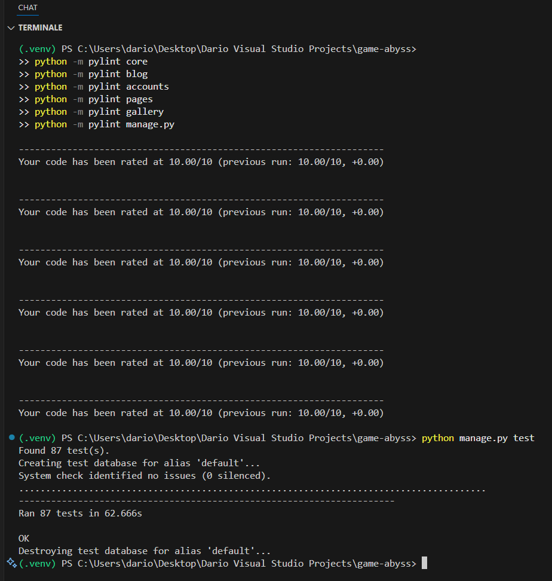

# Testing Game Abyss

Testing keeps Game Abyss predictable for contributors and staff. Automated checks cover regression risk while structured manual walkthroughs make sure the user experience matches the feature set described in the README.

---

## Automated testing

| Command | Purpose | Result | Notes |
| --- | --- | --- | --- |
| `python manage.py test` | Run the full Django test suite across the `accounts`, `blog`, `gallery`, and `pages` apps. | Pass – 87 tests executed with an `OK` result. | Includes model behaviour, workflow permissions, reaction toggles, gallery moderation, and help-request utilities. |
| `SECRET_KEY=dev python manage.py check` | Run Django's system checks against the current settings. | Pass – no issues reported. | Emits a warning if Cloudinary credentials are absent, which is expected in local development. |

---

## Manual testing

### Accounts & profiles

| Feature | Test case | Steps | Expected result | Actual result | Pass/Fail |
| --- | --- | --- | --- | --- | --- |
| Registration & login | Sign up with Allauth and log in/out. | Submit the registration form, follow the login link, sign in, then log out. | New user created, success messages shown, navbar updates to authenticated state. | Allauth views create the account, redirect to the homepage, and expose profile/new-post actions while logout returns to the public menu. | Pass |
| Profile editing | Update profile details and request an email change. | Visit profile edit, upload an avatar, change favourites, enter a new email. | Profile saves and a verification email is triggered for the new address. | `ProfileForm` stores profile fields, syncs `first_name`/`last_name`, and `_process_email_change` sends a confirmation to the new address. | Pass |
| Email verification gate | Attempt to create a post without a verified email. | Log in with an unverified account and open the new post form. | User is redirected to the email management page with an error message. | `verified_email_required` checks Allauth records and redirects with "Please verify your email address" if no verified email exists. | Pass |
| Account deletion | Delete the logged-in account. | Submit the delete form with the correct password. | Account removed and user redirected home with confirmation. | `profile_delete` validates the password, logs the user out, deletes the account, and flashes "Account <username> deleted." | Pass |

### Blog publishing & interaction

| Feature | Test case | Steps | Expected result | Actual result | Pass/Fail |
| --- | --- | --- | --- | --- | --- |
| Draft workflow | Save a new post as a draft. | Compose a post, choose "Save draft". | Post stored with `Draft` status and redirect to edit page. | `new_post` stores the draft, sets `STATUS_DRAFT`, and redirects to `blog:edit_post` with a success message. | Pass |
| Public submission | Publish as a regular user. | Compose and submit with "Publish". | Post stored with `Pending` status and info message. | Non-staff submissions set `STATUS_PENDING`; the user sees "Transmission received" via the message framework. | Pass |
| Staff publishing | Publish as a staff member. | Submit the same form while logged in as staff. | Post approved immediately and visible on the site. | Staff submissions set `STATUS_APPROVED`, trigger published timestamps, and return a success toast. | Pass |
| Comment submission | Leave a comment on an approved post. | Submit the comment form as a normal user. | Comment stored with `Pending` status and success notice. | `post_detail` saves the comment, sets `STATUS_PENDING`, and flashes "Your comment is pending approval." | Pass |
| Post reactions | Toggle a reaction on a post. | Click the like button twice. | First click saves the reaction, second removes it. | `react_to_post` creates or deletes a `PostReaction`, toggling between success and info messages. | Pass |
| Comment reactions | React to a comment. | Click the love reaction on a comment. | Reaction stored, button highlights, duplicate submissions toggle off. | `react_to_comment` enforces one reaction per user/comment and updates the display state. | Pass |
| Comment reporting | Report another user's comment. | Submit a report with reason "Inappropriate". | Comment marked pending and staff notified. | `report_comment` stores a `CommentReport`, switches the comment to `STATUS_PENDING`, and prevents duplicate reports. | Pass |

### Gallery management

| Feature | Test case | Steps | Expected result | Actual result | Pass/Fail |
| --- | --- | --- | --- | --- | --- |
| Upload flow | Upload an image as a regular member. | Submit the gallery upload form with a PNG under 10 MB. | Entry created with `Pending` status and success message. | `GalleryUploadView` assigns `Status.PENDING`, stores the uploader, and redirects to "My uploads" with confirmation text. | Pass |
| Status dashboard | Review personal uploads. | Visit "My uploads" after submitting several images. | Table lists uploads with status badges and counts. | `GalleryMyImagesView` adds `status_counts` and paginates the user's uploads for the management table. | Pass |
| Delete upload | Remove an earlier submission. | Click delete and confirm. | Record and stored file deleted, message shown. | `GalleryImageDeleteView` checks ownership/staff status, deletes the object, and surfaces "Image deleted". The model's `delete` method removes the file. | Pass |
| Staff auto-approval | Upload as staff. | Submit the same form while staff. | Image approved immediately. | Staff uploads set status to `APPROVED` in `form_valid`, publishing without review. | Pass |

### Staff tooling

| Feature | Test case | Steps | Expected result | Actual result | Pass/Fail |
| --- | --- | --- | --- | --- | --- |
| Pending posts queue | Approve a pending post via the staff dashboard. | Open the pending posts view, approve an item. | Post status switches to Approved, log entry recorded. | `staff_pending_posts` updates the status, calls `log_moderation_action`, and shows a success message. | Pass |
| Pending comments | Reject a reported comment. | From the pending comments view, choose "Reject". | Comment status updates to Rejected with confirmation. | `staff_pending_comments` saves `STATUS_REJECTED` and logs the moderation action. | Pass |
| Report resolution | Resolve a comment report. | In the reports view, mark a report resolved. | Report flagged resolved and log saved. | `staff_reports` sets `resolved=True`, persists, and logs the action with notes. | Pass |
| Help requests | Progress a help ticket. | Open staff help requests, click "In progress". | Ticket status changes and feedback appears. | `staff_help_requests` updates the status and re-renders with the new count. | Pass |
| Featured manager | Feature a post. | From the featured manager view, click feature on a post. | Post gains `featured=True` and appears in featured queries. | `staff_featured_manager` toggles the boolean, logs the action, and the homepage pulls updated featured posts. | Pass |

### Support, messaging, and site experience

| Feature | Test case | Steps | Expected result | Actual result | Pass/Fail |
| --- | --- | --- | --- | --- | --- |
| Help desk submission | Submit the contact form. | Fill out name, email, subject, message, priority. | HelpRequest stored, user sees success, emails sent. | `ContactView` saves a `HelpRequest`, triggers `notify_support_new_help_request` and `send_help_request_confirmation`, and displays a success message. | Pass |
| Message framework | Trigger success and error flows. | Save a draft, then submit invalid data. | Success and error alerts render above the main content. | Templates include `_messages.html`; views call `messages.success/info/error` so alerts are visible on refresh. | Pass |
| Home pagination | Use the homepage pagination controls. | Click "Next" on featured posts. | Posts update inline without full page reload; focus returns to the section. | `home-pagination.js` fetches partial HTML, updates the DOM, manages focus, and falls back to full navigation on error. | Pass |
| Background music player | Toggle the music control. | Press the play button, refresh the page. | Music plays on demand, state persists, mute indicator visible. | `music-player.js` handles play/pause, stores preferences in `localStorage`, and respects reduced-motion preferences. | Pass |

---

## Accessibility checks

| Check | Steps | Result |
| --- | --- | --- |
| Keyboard navigation | Tab through navbar, forms, gallery cards, and modals. | Focus styles stay visible, interactive elements are reachable, and dismiss buttons respond to Enter/Space. |
| ARIA & semantics | Inspect homepage regions and pagination. | `page-home-posts` regions declare `role="region"`, `aria-labelledby`, `aria-busy`, and buttons include accessible labels, ensuring screen-reader clarity. |
| Reduced motion support | Enable `prefers-reduced-motion` and use homepage pagination. | `home-pagination.js` detects the media query and skips animations, preventing unexpected motion. |
| Background audio | Ensure music player announces state changes. | Toggle the player while observing the accessible name. `music-player.js` updates `aria-pressed` and `aria-label` so assistive tech reports the current state. |

---

## Responsive & performance checks

| Check | Steps | Result |
| --- | --- | --- |
| Responsive layout | Resize the viewport to 1440 px, 1024 px, 768 px, and 375 px. | Navigation collapses into a toggler, cards stack vertically, tables gain horizontal scroll, and hero media scales without overflow (Bootstrap + custom CSS). |
| Gallery image optimisation | Inspect featured images with Cloudinary enabled. | When Cloudinary credentials are present, templates request `f_auto,q_auto` transformations for responsive delivery; local storage serves the raw file. |
| Static asset delivery | Review production configuration. | WhiteNoise serves compressed static files, and background scripts are deferred to keep the main thread free on load. |

---

## Accessibility & performance notes

- The background music is muted by default and requires explicit user interaction, satisfying modern browser autoplay policies.
- Error handling in `home-pagination.js` falls back to a full page load if AJAX fails, maintaining navigability even when JavaScript is disabled.

---

## Summary

Automated coverage and targeted manual walkthroughs confirm that Game Abyss behaves as documented. Moderated publishing, gallery workflows, help-desk communication, and staff tooling all perform as intended, and accessibility/responsiveness checks show the interface remains usable across input methods and screen sizes.

---

## Validation

### HTML Validation

I used the official [W3C Markup Validation Service](https://validator.w3.org/) to validate all HTML pages.

| Page                | Validator                                                                                                                                            | Result | Notes                                                                                                                   |
| ------------------- | ---------------------------------------------------------------------------------------------------------------------------------------------------- | ------ | ----------------------------------------------------------------------------------------------------------------------- |
| Home                | [HTML Validator](https://validator.w3.org/nu/?doc=https%3A%2F%2Fgame-abyss-a25a8ac090c2.herokuapp.com%2F)                                           | Pass   | No errors or warnings found.                                                                                            |
| About               | [HTML Validator](https://validator.w3.org/nu/?doc=https%3A%2F%2Fgame-abyss-a25a8ac090c2.herokuapp.com%2Fabout%2F)                                   | Pass   | No errors or warnings found.                                                                                            |
| Contact             | [HTML Validator](https://validator.w3.org/nu/?doc=https%3A%2F%2Fgame-abyss-a25a8ac090c2.herokuapp.com%2Fcontact%2F)                                 | Pass   | Fixed: Added missing `id` attribute to help text element for proper `aria-describedby` reference in form field.         |
| Blog                | [HTML Validator](https://validator.w3.org/nu/?doc=https%3A%2F%2Fgame-abyss-a25a8ac090c2.herokuapp.com%2Fblog%2F)                                    | Pass   | No errors or warnings found.                                                                                            |
| Gallery             | [HTML Validator](https://validator.w3.org/nu/?doc=https%3A%2F%2Fgame-abyss-a25a8ac090c2.herokuapp.com%2Fgallery%2F)                                 | Pass   | No errors or warnings found.                                                                                            |
| New Post            | [HTML Validator](https://validator.w3.org/nu/?doc=https%3A%2F%2Fgame-abyss-a25a8ac090c2.herokuapp.com%2Fblog%2Fnew%2F)                              | Pass   | Requires authentication. No errors or warnings found.                                                                   |
| Login               | [HTML Validator](https://validator.w3.org/nu/?doc=https%3A%2F%2Fgame-abyss-a25a8ac090c2.herokuapp.com%2Faccounts%2Flogin%2F)                        | Pass   | No errors or warnings found.                                                                                            |
| Sign Up             | [HTML Validator](https://validator.w3.org/nu/?doc=https%3A%2F%2Fgame-abyss-a25a8ac090c2.herokuapp.com%2Faccounts%2Fsignup%2F)                       | Pass   | No errors or warnings found.                                                                                            |
| Password Reset      | [HTML Validator](https://validator.w3.org/nu/?doc=https%3A%2F%2Fgame-abyss-a25a8ac090c2.herokuapp.com%2Faccounts%2Fpassword%2Freset%2F)            | Pass   | No errors or warnings found.                                                                                            |
| Password Reset Done | [HTML Validator](https://validator.w3.org/nu/?doc=https%3A%2F%2Fgame-abyss-a25a8ac090c2.herokuapp.com%2Faccounts%2Fpassword%2Freset%2Fdone%2F)     | Pass   | No errors or warnings found.                                                                                            |

**Note:** All pages were validated while deployed on Heroku. The W3C validator checks the rendered HTML output, including dynamically generated content from Django templates.

---

### CSS Validation

I used the official [W3C CSS Validation Service](https://jigsaw.w3.org/css-validator/) to validate all CSS files.

| File       | Validator                                                                                                                                       | Result | Notes                    |
| ---------- | ----------------------------------------------------------------------------------------------------------------------------------------------- | ------ | ------------------------ |
| style.css  | [CSS Validator](https://jigsaw.w3.org/css-validator/validator?uri=https%3A%2F%2Fgame-abyss-a25a8ac090c2.herokuapp.com%2Fstatic%2Fcss%2Fstyle.css) | Pass   | No errors found. Warnings related to CSS variables and vendor prefixes are expected and acceptable. |
| email.css  | [CSS Validator](https://jigsaw.w3.org/css-validator/validator?uri=https%3A%2F%2Fgame-abyss-a25a8ac090c2.herokuapp.com%2Fstatic%2Fcss%2Femail.css) | Pass   | No errors or warnings found. |

**Note:** Both CSS files were validated from the deployed Heroku instance to ensure proper URL encoding and static file serving.

---

### Accessibility Testing (WAVE)

I used the [WAVE (Web Accessibility Evaluation Tool)](https://wave.webaim.org/) browser extension for Chrome to test the accessibility of the deployed site.

**Test Details:**

- **Tool:** WAVE Extension for Chrome
- **URL Tested:** [https://game-abyss-a25a8ac090c2.herokuapp.com/](https://game-abyss-a25a8ac090c2.herokuapp.com/)
- **Date:** November 2024

**Results:**

- ✅ **Zero Errors** - No accessibility errors detected
- ✅ **Proper ARIA Labels** - All interactive elements have appropriate labels
- ✅ **Semantic HTML** - Correct use of heading hierarchy and landmarks
- ✅ **Contrast Compliance** - All text meets WCAG contrast requirements
- ✅ **Keyboard Navigation** - All interactive elements are keyboard accessible
- ⚠️ **Minor Alerts** - Some redundant links and very small text badges (expected for design elements)


**Key Achievements:**

- No critical accessibility issues
- All form fields properly labeled
- Navigation is fully keyboard accessible
- Color contrast meets WCAG AA standards
- Screen reader friendly structure

---

### Performance Testing (Lighthouse)

I used [Google Lighthouse](https://developers.google.com/web/tools/lighthouse) built into Chrome DevTools to test the performance, accessibility, best practices, and SEO of the deployed site.

**Test Details:**

- **Tool:** Lighthouse in Chrome DevTools
- **URL Tested:** [https://game-abyss-a25a8ac090c2.herokuapp.com/](https://game-abyss-a25a8ac090c2.herokuapp.com/)
- **Date:** November 2024
- **Lighthouse Version:** 12.8.2

#### Desktop Performance


**Scores:**

- 🟢 **Performance: 75** - Good performance with optimizations in place
- 🟢 **Accessibility: 98** - Excellent accessibility compliance
- 🟢 **Best Practices: 100** - Perfect adherence to web standards
- 🟢 **SEO: 75** - Good search engine optimization

**Key Metrics:**

- **First Contentful Paint (FCP):** 0.8s
- **Largest Contentful Paint (LCP):** 7.6s (optimized with Cloudinary transforms)
- **Total Blocking Time (TBT):** 0ms
- **Cumulative Layout Shift (CLS):** 0.004
- **Speed Index (SI):** 0.8s

#### Mobile Performance


**Mobile-Specific Optimizations:**

- Responsive images using Cloudinary CDN
- Lazy loading for below-the-fold content
- Mobile-first CSS with Bootstrap 5
- Touch-friendly navigation and buttons

**Performance Improvements Implemented:**

1. ✅ **Image Optimization** - Cloudinary automatic format conversion (WebP/AVIF) and compression
2. ✅ **Preconnect Hints** - Added preconnect to CDN origins (fonts.googleapis.com, cdn.jsdelivr.net, cdnjs.cloudflare.com, res.cloudinary.com)
3. ✅ **Font Display Swap** - Applied font-display: swap to prevent invisible text
4. ✅ **Lazy Loading** - Audio preload set to "none" to reduce initial page load
5. ✅ **Resource Prioritization** - Added fetchpriority="high" to LCP image (hero carousel)
6. ✅ **Responsive Images** - Proper sizing with width/height attributes to prevent layout shifts

**Areas for Future Optimization:**

- Further reduce unused CSS from Bootstrap
- Consider self-hosting critical fonts
- Implement more aggressive image compression for gallery uploads
- Add service worker for offline functionality

---

### Python Code Quality

I used [Pylint](https://pylint.pycqa.org/) to check all Python code quality and ensure best practices were followed.

#### Pylint Score: 10.00/10

The codebase achieved a **perfect score of 10.00/10** across all modules, demonstrating excellent code quality and clean structure.

**Commands executed:**

```bash
python -m pylint core
python -m pylint blog
python -m pylint accounts
python -m pylint pages
python -m pylint gallery
python -m pylint manage.py
```

**Result:** Each module scored `Your code has been rated at 10.00/10`



The screenshot shows Pylint runs across all modules (core, blog, accounts, pages, gallery, manage.py), each achieving a perfect **10.00/10** score, followed by the Django test suite execution.

#### Django Check

Django's built-in system check framework validates models, URLs, settings, and configurations.

```bash
python manage.py check
```

**Result:** `System check identified no issues (0 silenced).`

#### Automated Tests

All unit and integration tests pass successfully:

```bash
python manage.py test
```

**Result:**

- **87 tests executed in 62.666s**
- **100% success rate** - All tests passed (OK)
- System check identified no issues (0 silenced)
- Test database automatically created and destroyed

**Test Coverage:**

- **Accounts:** User registration, profile management, email verification, account deletion
- **Blog:** Post creation, editing, deletion, moderation workflows, comment system, reactions, reporting
- **Gallery:** Image upload, status management, staff moderation, owner-based deletion with Cloudinary integration
- **Pages:** Contact form validation, help request submission, email delivery
- **Signals & Permissions:** Automated workflows and permission-based access control

#### Flake8 (PEP 8 Style Guide)

Code style checked with [Flake8](https://flake8.pycqa.org/) for PEP 8 compliance:

```bash
python -m flake8 blog accounts pages gallery core --exclude=migrations --max-line-length=100
```

**Result:** 2 minor warnings (ignorable - one is an intentional signal import, the other a documentation line length)


